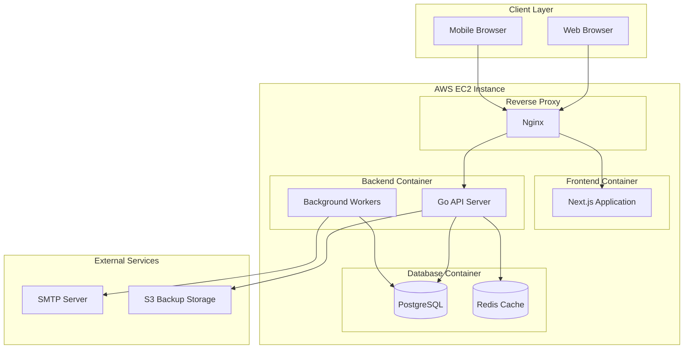

# CertiTrack - Comprehensive Architecture & Development Plan

## Project Overview

CertiTrack is a web-based certification management system designed for small organizations (50-200 users) to track, manage, and monitor certifications for personnel and equipment. The system provides automated notifications for expiring certifications, ensuring compliance and operational continuity.

## 📋 Architecture Documentation

This repository contains a complete architectural blueprint for CertiTrack, covering all aspects from requirements analysis to deployment strategy. The documentation is organized into the following key areas:

### 🔍 Analysis & Requirements
- **[Requirements Analysis](requirements-analysis.md)** - Detailed business requirements, constraints, and non-functional requirements
- **[MVP Development Plan](mvp-development-plan.md)** - Feature prioritization, development phases, and 16-week implementation timeline

### 🏗️ System Design
- **[System Architecture](system-architecture.md)** - High-level architecture, component design, and technology stack
- **[Database Schema](database-schema.md)** - Complete database design with entity relationships and sample data
- **[API Specification](api-specification.md)** - RESTful API endpoints, data contracts, and response formats

### 🎨 User Experience
- **[UI Design & User Flows](ui-design.md)** - Wireframes, user interface design, and user journey mapping
- **[Authentication & Authorization](authentication-authorization.md)** - Security architecture and access control design

### 🔧 Technical Implementation
- **[Notification System](notification-system.md)** - Automated email notification architecture and implementation
- **[File Management System](file-management-system.md)** - Secure document upload, storage, and retrieval system
- **[Security Considerations](security-considerations.md)** - Comprehensive security measures and threat mitigation

### 🚀 Development & Deployment
- **[Development Setup](development-setup.md)** - Complete development environment configuration guide
- **[Project Structure & Guidelines](project-structure-guidelines.md)** - Code organization, standards, and development workflows
- **[Testing Strategy](testing-strategy.md)** - Comprehensive testing approach including unit, integration, and E2E testing
- **[Deployment Strategy](deployment-strategy.md)** - AWS infrastructure setup and deployment automation

## 🏛️ System Architecture Overview



## 🛠️ Technology Stack

### Frontend
- **Framework**: Next.js 14 with React 18
- **Language**: TypeScript
- **Styling**: Tailwind CSS
- **State Management**: React Context + Custom Hooks
- **Testing**: Jest + React Testing Library + Playwright

### Backend
- **Language**: Go 1.21+
- **Framework**: Gin HTTP Framework
- **ORM**: GORM
- **Authentication**: JWT with refresh tokens
- **Background Jobs**: Redis-based job queue

### Database & Storage
- **Primary Database**: PostgreSQL 15
- **Cache**: Redis 7
- **File Storage**: Local filesystem with S3 backup
- **Search**: PostgreSQL full-text search

### Infrastructure
- **Deployment**: AWS EC2 with Docker Compose
- **Reverse Proxy**: Nginx with SSL/TLS
- **Monitoring**: CloudWatch + Custom metrics
- **CI/CD**: GitHub Actions

## 📊 Key Features

### Core Functionality
- **User Management**: Role-based access control (Admin/User)
- **Personnel Tracking**: Employee profiles and certification assignments
- **Equipment Management**: Asset tracking with certification requirements
- **Certification Management**: Complete lifecycle management with status tracking
- **Automated Notifications**: Configurable email alerts for expiring certifications
- **Document Management**: Secure file upload and storage with virus scanning
- **Dashboard & Reporting**: Real-time insights and exportable reports

### Security Features
- **Authentication**: JWT-based with secure password requirements
- **Authorization**: Role-based access control with resource-level permissions
- **Data Protection**: Input validation, SQL injection prevention, XSS protection
- **File Security**: Type validation, virus scanning, secure storage
- **Audit Trail**: Comprehensive logging of all system activities
- **Network Security**: HTTPS enforcement, rate limiting, security headers

## 📈 Development Timeline

The MVP is planned for a 16-week development cycle divided into 4 phases:

1. **Phase 1: Foundation** (Weeks 1-4) - Infrastructure, authentication, core models
2. **Phase 2: Core Functionality** (Weeks 5-8) - Certification management, dashboard, reporting
3. **Phase 3: Notifications & Automation** (Weeks 9-12) - Email system, automated alerts
4. **Phase 4: File Management & Polish** (Weeks 13-16) - Document upload, optimization, testing

## 🎯 Success Metrics

### Technical KPIs
- **Performance**: Page load times < 2 seconds
- **Reliability**: 99% uptime
- **Security**: Zero critical vulnerabilities
- **Test Coverage**: >80% code coverage

### Business KPIs
- **User Adoption**: 80% active users within 30 days
- **Data Completeness**: 95% of certifications tracked
- **Notification Effectiveness**: 90% of alerts acted upon
- **User Satisfaction**: >4.0/5.0 rating

## 💰 Cost Estimation

### Monthly AWS Costs (Production)
- **EC2 t3.medium**: ~$30
- **EBS 100GB**: ~$8
- **Data Transfer**: ~$9
- **S3 Storage**: ~$1
- **CloudWatch**: ~$5
- **Total**: ~$53/month

## 🚀 Getting Started

### Quick Start

1. **Clone the repository**:
   ```bash
   git clone <repository-url>
   cd certitrack
   ```

2. **Run the setup script**:
   ```bash
   ./scripts/setup.sh
   ```

3. **Start development servers**:
   ```bash
   make dev
   ```

4. **Access the application**:
   - Frontend: http://localhost:3000
   - Backend API: http://localhost:8080
   - API Health Check: http://localhost:8080/health
   - Email Testing (Mailhog): http://localhost:8025

### Manual Setup (Alternative)

If you prefer to set up manually:

1. **Prerequisites**:
   - Docker & Docker Compose
   - Go 1.21+
   - Node.js 18+
   - npm 9+

2. **Environment Setup**:
   ```bash
   cp .env.example .env
   ```

3. **Backend Setup**:
   ```bash
   cd backend
   go mod tidy
   cd ..
   ```

4. **Frontend Setup**:
   ```bash
   cd frontend
   npm install
   cd ..
   ```

5. **Start Services**:
   ```bash
   docker-compose up -d
   make dev
   ```

### Architecture Review

1. **System Overview**: Start with [System Architecture](docs/system-architecture.md)
2. **Database Design**: Review [Database Schema](docs/database-schema.md)
3. **API Reference**: Check [API Specification](docs/api-specification.md)
4. **Security**: Follow [Security Considerations](docs/security-considerations.md)
5. **Development**: Read [Development Setup](docs/development-setup.md)

## 📚 Documentation Structure

```
docs/
├── requirements-analysis.md          # Business requirements and constraints
├── system-architecture.md            # High-level system design
├── database-schema.md                # Database design and relationships
├── api-specification.md              # REST API documentation
├── ui-design.md                      # User interface and experience design
├── authentication-authorization.md   # Security and access control
├── notification-system.md            # Email notification architecture
├── file-management-system.md         # Document management system
├── deployment-strategy.md            # Infrastructure and deployment
├── development-setup.md              # Development environment guide
├── testing-strategy.md               # Quality assurance approach
├── security-considerations.md        # Security measures and best practices
├── project-structure-guidelines.md   # Code organization and standards
├── mvp-development-plan.md           # Feature prioritization and timeline
└── README.md                         # This overview document
```

## 🤝 Contributing

This architectural documentation serves as the foundation for CertiTrack development. Each document provides detailed specifications that can be used by development teams to implement the system according to the defined standards and best practices.

## 📄 License

This architectural documentation is provided as a comprehensive blueprint for building a certification management system. Implementation details may be adapted based on specific organizational requirements and constraints.

---

**CertiTrack Architecture v1.0** - A comprehensive certification management solution designed for reliability, security, and scalability.