# CertiTrack - Sistema de Autenticación y Autorización

## Visión General

CertiTrack implementa un sistema de autenticación basado en JWT con control de acceso basado en roles (RBAC) que soporta dos tipos de usuarios: Administradores y Usuarios Regulares.

## Arquitectura de Autenticación

### Estrategia de Tokens JWT

```mermaid
graph TB
    subgraph "Authentication Flow"
        A[User Login] --> B[Validate Credentials]
        B --> C[Generate JWT Access Token]
        C --> D[Generate Refresh Token]
        D --> E[Store Refresh Token in DB]
        E --> F[Return Tokens to Client]
    end
    
    subgraph "Token Validation"
        G[API Request] --> H[Extract JWT from Header]
        H --> I[Validate Token Signature]
        I --> J[Check Token Expiration]
        J --> K[Extract User Claims]
        K --> L[Authorize Request]
    end
    
    subgraph "Token Refresh"
        M[Access Token Expired] --> N[Use Refresh Token]
        N --> O[Validate Refresh Token]
        O --> P[Generate New Access Token]
        P --> Q[Return New Token]
    end
```



### Configuración de Tokens

#### Token de Acceso (JWT)
- **Expiración**: 15 minutos
- **Algoritmo**: HS256 (HMAC con SHA-256)
- **Almacenamiento**: Lado del cliente (memory/localStorage)
- **Propósito**: Autenticación de API

#### Token de Actualización
- **Expiración**: 7 días
- **Almacenamiento**: Base de datos (hasheado) + cookie HTTP-only
- **Propósito**: Generar nuevos tokens de acceso
- **Rotación**: Se emite un nuevo token de actualización en cada uso

### Estructura del Payload JWT

```json
{
  "sub": "user-uuid-here",
  "email": "user@example.com",
  "role": "admin",
  "firstName": "John",
  "lastName": "Doe",
  "iat": 1640995200,
  "exp": 1640996100,
  "iss": "certitrack-api",
  "aud": "certitrack-client"
}
```

## Implementación de Autenticación

### Implementación en el Backend con Go

#### Interfaz del Servicio JWT
```go
type JWTService interface {
    GenerateTokenPair(user *models.User) (*TokenPair, error)
    ValidateAccessToken(tokenString string) (*Claims, error)
    RefreshAccessToken(refreshToken string) (*TokenPair, error)
    RevokeRefreshToken(tokenID string) error
}

type TokenPair struct {
    AccessToken  string    `json:"accessToken"`
    RefreshToken string    `json:"refreshToken"`
    ExpiresAt    time.Time `json:"expiresAt"`
}

type Claims struct {
    UserID    uuid.UUID `json:"sub"`
    Email     string    `json:"email"`
    Role      string    `json:"role"`
    FirstName string    `json:"firstName"`
    LastName  string    `json:"lastName"`
    jwt.RegisteredClaims
}
```

#### Middleware de Autenticación
```go
func AuthMiddleware(jwtService JWTService) gin.HandlerFunc {
    return func(c *gin.Context) {
        authHeader := c.GetHeader("Authorization")
        if authHeader == "" {
            c.JSON(401, gin.H{"error": "Authorization header required"})
            c.Abort()
            return
        }

        tokenString := strings.TrimPrefix(authHeader, "Bearer ")
        claims, err := jwtService.ValidateAccessToken(tokenString)
        if err != nil {
            c.JSON(401, gin.H{"error": "Invalid token"})
            c.Abort()
            return
        }

        // Store user info in context
        c.Set("userID", claims.UserID)
        c.Set("userRole", claims.Role)
        c.Set("userEmail", claims.Email)
        
        c.Next()
    }
}
```

#### Seguridad de Contraseñas
```go
type PasswordService interface {
    HashPassword(password string) (string, error)
    VerifyPassword(hashedPassword, password string) bool
    ValidatePasswordStrength(password string) error
}

// Implementation using bcrypt
func (ps *passwordService) HashPassword(password string) (string, error) {
    bytes, err := bcrypt.GenerateFromPassword([]byte(password), bcrypt.DefaultCost)
    return string(bytes), err
}

func (ps *passwordService) VerifyPassword(hashedPassword, password string) bool {
    err := bcrypt.CompareHashAndPassword([]byte(hashedPassword), []byte(password))
    return err == nil
}
```

### Implementación en el Frontend (Next.js)

#### Contexto de Autenticación
```typescript
interface AuthContextType {
  user: User | null;
  login: (email: string, password: string) => Promise<void>;
  logout: () => void;
  refreshToken: () => Promise<void>;
  isAuthenticated: boolean;
  isLoading: boolean;
}

const AuthContext = createContext<AuthContextType | undefined>(undefined);

export const AuthProvider: React.FC<{ children: React.ReactNode }> = ({ children }) => {
  const [user, setUser] = useState<User | null>(null);
  const [isLoading, setIsLoading] = useState(true);

  const login = async (email: string, password: string) => {
    const response = await api.post('/auth/login', { email, password });
    const { user, token, expiresAt } = response.data.data;
    
    setUser(user);
    localStorage.setItem('accessToken', token);
    localStorage.setItem('tokenExpiry', expiresAt);
    
    // Set up automatic token refresh
    scheduleTokenRefresh(expiresAt);
  };

  const logout = () => {
    setUser(null);
    localStorage.removeItem('accessToken');
    localStorage.removeItem('tokenExpiry');
    // Redirect to login
  };

  // ... other methods
};
```

#### Cliente API con Gestión de Tokens
```typescript
class ApiClient {
  private baseURL: string;
  private accessToken: string | null = null;

  constructor(baseURL: string) {
    this.baseURL = baseURL;
    this.setupInterceptors();
  }

  private setupInterceptors() {
    // Request interceptor to add auth header
    axios.interceptors.request.use((config) => {
      const token = localStorage.getItem('accessToken');
      if (token) {
        config.headers.Authorization = `Bearer ${token}`;
      }
      return config;
    });

    // Response interceptor to handle token expiration
    axios.interceptors.response.use(
      (response) => response,
      async (error) => {
        if (error.response?.status === 401) {
          try {
            await this.refreshToken();
            // Retry original request
            return axios.request(error.config);
          } catch (refreshError) {
            // Redirect to login
            window.location.href = '/login';
          }
        }
        return Promise.reject(error);
      }
    );
  }

  private async refreshToken() {
    const response = await axios.post('/api/v1/auth/refresh');
    const { token, expiresAt } = response.data.data;
    
    localStorage.setItem('accessToken', token);
    localStorage.setItem('tokenExpiry', expiresAt);
  }
}
```

## Sistema de Autorización

### Control de Acceso Basado en Roles (RBAC)

#### Roles de Usuario

**Rol de Administrador**
- Acceso completo al sistema
- Gestión de usuarios (crear, actualizar, eliminar usuarios)
- Configuración del sistema
- Todas las operaciones CRUD en todas las entidades
- Acceso a todos los informes y análisis
- Gestión de reglas de notificación

**Rol de Usuario Regular**
- Ver su propio perfil
- Ver personas y equipos (solo lectura)
- Ver todas las certificaciones (solo lectura)
- Crear/actualizar certificaciones (con restricciones)
- Ver informes y paneles de control
- No puede gestionar usuarios ni configuraciones del sistema

### Matriz de Permisos

| Recurso | Admin | Usuario |
|---------|-------|---------|
| **Usuarios** |
| Crear Usuario | ✅ | ❌ |
| Ver Usuarios | ✅ | ❌ |
| Actualizar Usuario | ✅ | ❌ |
| Eliminar Usuario | ✅ | ❌ |
| **Personas** |
| Crear Persona | ✅ | ✅ |
| Ver Personas | ✅ | ✅ |
| Actualizar Persona | ✅ | ✅* |
| Eliminar Persona | ✅ | ❌ |
| **Equipos** |
| Crear Equipo | ✅ | ✅ |
| Ver Equipos | ✅ | ✅ |
| Actualizar Equipo | ✅ | ✅* |
| Eliminar Equipo | ✅ | ❌ |
| **Certificaciones** |
| Crear Certificación | ✅ | ✅ |
| Ver Certificaciones | ✅ | ✅ |
| Actualizar Certificación | ✅ | ✅* |
| Eliminar Certificación | ✅ | ❌ |
| **Tipos de Certificación** |
| Crear Tipo | ✅ | ❌ |
| Ver Tipos | ✅ | ✅ |
| Actualizar Tipo | ✅ | ❌ |
| Eliminar Tipo | ✅ | ❌ |
| **Informes** |
| Ver Informes | ✅ | ✅ |
| Exportar Informes | ✅ | ✅ |
| **Notificaciones** |
| Ver Notificaciones | ✅ | ✅ |
| Gestionar Reglas | ✅ | ❌ |

*Limitado a los registros que crearon o tienen asignados

### Implementación de la Autorización

#### Middleware de Autorización en el Backend
```go
func RequireRole(allowedRoles ...string) gin.HandlerFunc {
    return func(c *gin.Context) {
        userRole, exists := c.Get("userRole")
        if !exists {
            c.JSON(403, gin.H{"error": "User role not found"})
            c.Abort()
            return
        }

        role := userRole.(string)
        for _, allowedRole := range allowedRoles {
            if role == allowedRole {
                c.Next()
                return
            }
        }

        c.JSON(403, gin.H{"error": "Insufficient permissions"})
        c.Abort()
    }
}

// Usage in routes
router.POST("/users", AuthMiddleware(jwtService), RequireRole("admin"), createUser)
router.GET("/users", AuthMiddleware(jwtService), RequireRole("admin"), getUsers)
```

#### Resource-Level Authorization
```go
func CanModifyResource(c *gin.Context, resourceCreatorID uuid.UUID) bool {
    userID, _ := c.Get("userID")
    userRole, _ := c.Get("userRole")
    
    // Admins can modify any resource
    if userRole == "admin" {
        return true
    }
    
    // Regular users can only modify resources they created
    return userID == resourceCreatorID
}
```

#### Protección de Rutas en el Frontend
```typescript
// Higher-order component for route protection
export const withAuth = <P extends object>(
  Component: React.ComponentType<P>,
  requiredRole?: string
) => {
  return (props: P) => {
    const { user, isAuthenticated, isLoading } = useAuth();
    const router = useRouter();

    useEffect(() => {
      if (!isLoading) {
        if (!isAuthenticated) {
          router.push('/login');
          return;
        }

        if (requiredRole && user?.role !== requiredRole) {
          router.push('/unauthorized');
          return;
        }
      }
    }, [isAuthenticated, isLoading, user, router]);

    if (isLoading) {
      return <LoadingSpinner />;
    }

    if (!isAuthenticated) {
      return null;
    }

    if (requiredRole && user?.role !== requiredRole) {
      return null;
    }

    return <Component {...props} />;
  };
};

// Usage
export default withAuth(AdminPanel, 'admin');
```

## Medidas de Seguridad

### Seguridad de Contraseñas
- **Requisitos Mínimos**: 8 caracteres, mayúsculas y minúsculas, números, caracteres especiales
- **Cifrado**: bcrypt con sal (factor de costo 12)
- **Historial de Contraseñas**: Evitar reutilizar las últimas 5 contraseñas
- **Bloqueo de Cuenta**: 5 intentos fallidos = bloqueo de 15 minutos

### Seguridad de Tokens
- **Almacenamiento Seguro**: Tokens de actualización almacenados en cookies HTTP-only
- **Rotación de Tokens**: Nuevo token de actualización en cada uso
- **Revocación**: Capacidad para revocar todos los tokens de un usuario
- **Caducidad Corta**: Los tokens de acceso expiran en 15 minutos

### Gestión de Sesiones
```go
type SessionService interface {
    CreateSession(userID uuid.UUID, refreshToken string) error
    ValidateSession(refreshToken string) (*Session, error)
    RevokeSession(sessionID uuid.UUID) error
    RevokeAllUserSessions(userID uuid.UUID) error
}

type Session struct {
    ID           uuid.UUID `gorm:"type:uuid;primary_key;default:gen_random_uuid()"`
    UserID       uuid.UUID `gorm:"type:uuid;not null"`
    RefreshToken string    `gorm:"not null"`
    ExpiresAt    time.Time `gorm:"not null"`
    CreatedAt    time.Time
    IPAddress    string
    UserAgent    string
}
```

### Límite de Tasas
```go
// Rate limiting middleware
func RateLimitMiddleware() gin.HandlerFunc {
    limiter := rate.NewLimiter(rate.Every(time.Minute), 60) // 60 requests per minute
    
    return func(c *gin.Context) {
        if !limiter.Allow() {
            c.JSON(429, gin.H{"error": "Rate limit exceeded"})
            c.Abort()
            return
        }
        c.Next()
    }
}

// Stricter rate limiting for auth endpoints
func AuthRateLimitMiddleware() gin.HandlerFunc {
    limiter := rate.NewLimiter(rate.Every(time.Minute), 5) // 5 login attempts per minute
    
    return func(c *gin.Context) {
        if !limiter.Allow() {
            c.JSON(429, gin.H{"error": "Too many login attempts"})
            c.Abort()
            return
        }
        c.Next()
    }
}
```

## Registro de Auditoría

### Eventos de Autenticación
```go
type AuthEvent struct {
    ID        uuid.UUID `gorm:"type:uuid;primary_key;default:gen_random_uuid()"`
    UserID    uuid.UUID `gorm:"type:uuid"`
    Event     string    `gorm:"not null"` // LOGIN, LOGOUT, TOKEN_REFRESH, FAILED_LOGIN
    IPAddress string
    UserAgent string
    Success   bool
    Details   string
    CreatedAt time.Time
}

func LogAuthEvent(userID uuid.UUID, event string, success bool, details string, c *gin.Context) {
    authEvent := AuthEvent{
        UserID:    userID,
        Event:     event,
        IPAddress: c.ClientIP(),
        UserAgent: c.GetHeader("User-Agent"),
        Success:   success,
        Details:   details,
        CreatedAt: time.Now(),
    }
    
    // Save to database
    db.Create(&authEvent)
}
```

## Configuración del Entorno

### Configuración de JWT
```env
# JWT Settings
JWT_SECRET=your-super-secret-jwt-key-here
JWT_ACCESS_TOKEN_EXPIRY=15m
JWT_REFRESH_TOKEN_EXPIRY=168h
JWT_ISSUER=certitrack-api
JWT_AUDIENCE=certitrack-client

# Security Settings
BCRYPT_COST=12
MAX_LOGIN_ATTEMPTS=5
LOCKOUT_DURATION=15m
SESSION_TIMEOUT=24h

# Rate Limiting
RATE_LIMIT_REQUESTS_PER_MINUTE=60
AUTH_RATE_LIMIT_REQUESTS_PER_MINUTE=5
```

Este sistema de autenticación y autorización proporciona una seguridad robusta manteniendo la usabilidad de la aplicación CertiTrack, asegurando que los datos sensibles de certificación estén adecuadamente protegidos y el acceso sea controlado apropiadamente según los roles de los usuarios.