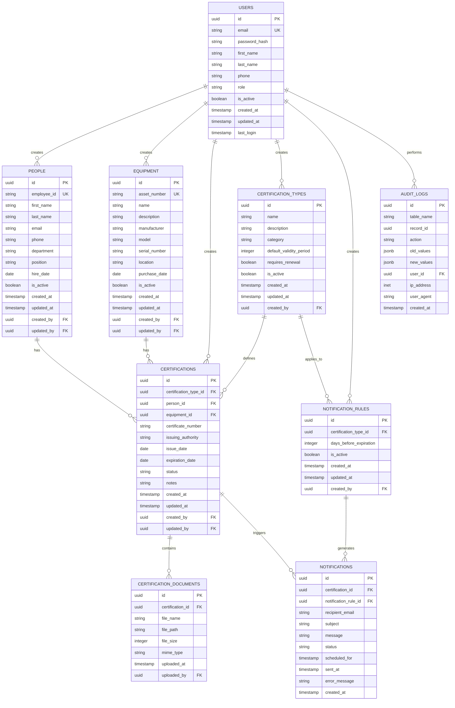

# CertiTrack - Diseño del Esquema de Base de Datos

## Visión General de las Relaciones

El sistema CertiTrack gestiona certificaciones tanto para personas como para equipos, con un sistema de notificaciones flexible y capacidades de auditoría.

## Entidades Principales

### 1. Tabla de Usuarios
```sql
CREATE TABLE users (
    id UUID PRIMARY KEY DEFAULT gen_random_uuid(),
    email VARCHAR(255) UNIQUE NOT NULL,
    password_hash VARCHAR(255) NOT NULL,
    first_name VARCHAR(100) NOT NULL,
    last_name VARCHAR(100) NOT NULL,
    phone VARCHAR(20),
    role VARCHAR(20) NOT NULL DEFAULT 'user', -- 'admin' or 'user'
    is_active BOOLEAN DEFAULT true,
    created_at TIMESTAMP WITH TIME ZONE DEFAULT NOW(),
    updated_at TIMESTAMP WITH TIME ZONE DEFAULT NOW(),
    last_login TIMESTAMP WITH TIME ZONE
);
```

### 2. Tabla de Personas
```sql
CREATE TABLE people (
    id UUID PRIMARY KEY DEFAULT gen_random_uuid(),
    employee_id VARCHAR(50) UNIQUE,
    first_name VARCHAR(100) NOT NULL,
    last_name VARCHAR(100) NOT NULL,
    email VARCHAR(255),
    phone VARCHAR(20),
    department VARCHAR(100),
    position VARCHAR(100),
    hire_date DATE,
    is_active BOOLEAN DEFAULT true,
    created_at TIMESTAMP WITH TIME ZONE DEFAULT NOW(),
    updated_at TIMESTAMP WITH TIME ZONE DEFAULT NOW(),
    created_by UUID REFERENCES users(id),
    updated_by UUID REFERENCES users(id)
);
```

### 3. Tabla de Equipos
```sql
CREATE TABLE equipment (
    id UUID PRIMARY KEY DEFAULT gen_random_uuid(),
    asset_number VARCHAR(100) UNIQUE NOT NULL,
    name VARCHAR(200) NOT NULL,
    description TEXT,
    manufacturer VARCHAR(100),
    model VARCHAR(100),
    serial_number VARCHAR(100),
    location VARCHAR(200),
    purchase_date DATE,
    is_active BOOLEAN DEFAULT true,
    created_at TIMESTAMP WITH TIME ZONE DEFAULT NOW(),
    updated_at TIMESTAMP WITH TIME ZONE DEFAULT NOW(),
    created_by UUID REFERENCES users(id),
    updated_by UUID REFERENCES users(id)
);
```

### 4. Tabla de Tipos de Certificación
```sql
CREATE TABLE certification_types (
    id UUID PRIMARY KEY DEFAULT gen_random_uuid(),
    name VARCHAR(200) NOT NULL,
    description TEXT,
    category VARCHAR(50) NOT NULL, -- 'safety', 'professional', 'equipment'
    default_validity_period INTEGER, -- in days
    requires_renewal BOOLEAN DEFAULT true,
    is_active BOOLEAN DEFAULT true,
    created_at TIMESTAMP WITH TIME ZONE DEFAULT NOW(),
    updated_at TIMESTAMP WITH TIME ZONE DEFAULT NOW(),
    created_by UUID REFERENCES users(id)
);
```

### 5. Tabla de Certificaciones
```sql
CREATE TABLE certifications (
    id UUID PRIMARY KEY DEFAULT gen_random_uuid(),
    certification_type_id UUID NOT NULL REFERENCES certification_types(id),
    person_id UUID REFERENCES people(id),
    equipment_id UUID REFERENCES equipment(id),
    certificate_number VARCHAR(100),
    issuing_authority VARCHAR(200),
    issue_date DATE NOT NULL,
    expiration_date DATE NOT NULL,
    status VARCHAR(20) DEFAULT 'active', -- 'active', 'expired', 'revoked', 'pending'
    notes TEXT,
    created_at TIMESTAMP WITH TIME ZONE DEFAULT NOW(),
    updated_at TIMESTAMP WITH TIME ZONE DEFAULT NOW(),
    created_by UUID REFERENCES users(id),
    updated_by UUID REFERENCES users(id),
    
    -- Ensure certification is linked to either person or equipment, not both
    CONSTRAINT check_person_or_equipment CHECK (
        (person_id IS NOT NULL AND equipment_id IS NULL) OR 
        (person_id IS NULL AND equipment_id IS NOT NULL)
    )
);
```

### 6. Tabla de Documentos de Certificación
```sql
CREATE TABLE certification_documents (
    id UUID PRIMARY KEY DEFAULT gen_random_uuid(),
    certification_id UUID NOT NULL REFERENCES certifications(id) ON DELETE CASCADE,
    file_name VARCHAR(255) NOT NULL,
    file_path VARCHAR(500) NOT NULL,
    file_size INTEGER,
    mime_type VARCHAR(100),
    uploaded_at TIMESTAMP WITH TIME ZONE DEFAULT NOW(),
    uploaded_by UUID REFERENCES users(id)
);
```

### 7. Tabla de Reglas de Notificación
```sql
CREATE TABLE notification_rules (
    id UUID PRIMARY KEY DEFAULT gen_random_uuid(),
    certification_type_id UUID REFERENCES certification_types(id),
    days_before_expiration INTEGER NOT NULL,
    is_active BOOLEAN DEFAULT true,
    created_at TIMESTAMP WITH TIME ZONE DEFAULT NOW(),
    updated_at TIMESTAMP WITH TIME ZONE DEFAULT NOW(),
    created_by UUID REFERENCES users(id)
);
```

### 8. Tabla de Notificaciones
```sql
CREATE TABLE notifications (
    id UUID PRIMARY KEY DEFAULT gen_random_uuid(),
    certification_id UUID NOT NULL REFERENCES certifications(id),
    notification_rule_id UUID REFERENCES notification_rules(id),
    recipient_email VARCHAR(255) NOT NULL,
    subject VARCHAR(255) NOT NULL,
    message TEXT NOT NULL,
    status VARCHAR(20) DEFAULT 'pending', -- 'pending', 'sent', 'failed'
    scheduled_for TIMESTAMP WITH TIME ZONE NOT NULL,
    sent_at TIMESTAMP WITH TIME ZONE,
    error_message TEXT,
    created_at TIMESTAMP WITH TIME ZONE DEFAULT NOW()
);
```

### 9. Tabla de Registro de Auditoría
```sql
CREATE TABLE audit_logs (
    id UUID PRIMARY KEY DEFAULT gen_random_uuid(),
    table_name VARCHAR(50) NOT NULL,
    record_id UUID NOT NULL,
    action VARCHAR(20) NOT NULL, -- 'CREATE', 'UPDATE', 'DELETE'
    old_values JSONB,
    new_values JSONB,
    user_id UUID REFERENCES users(id),
    ip_address INET,
    user_agent TEXT,
    created_at TIMESTAMP WITH TIME ZONE DEFAULT NOW()
);
```

## Índices para el Rendimiento

```sql
-- Users
CREATE INDEX idx_users_email ON users(email);
CREATE INDEX idx_users_role ON users(role);

-- People
CREATE INDEX idx_people_employee_id ON people(employee_id);
CREATE INDEX idx_people_email ON people(email);
CREATE INDEX idx_people_active ON people(is_active);

-- Equipment
CREATE INDEX idx_equipment_asset_number ON equipment(asset_number);
CREATE INDEX idx_equipment_active ON equipment(is_active);

-- Certifications
CREATE INDEX idx_certifications_person_id ON certifications(person_id);
CREATE INDEX idx_certifications_equipment_id ON certifications(equipment_id);
CREATE INDEX idx_certifications_type_id ON certifications(certification_type_id);
CREATE INDEX idx_certifications_expiration_date ON certifications(expiration_date);
CREATE INDEX idx_certifications_status ON certifications(status);
CREATE INDEX idx_certifications_expiration_status ON certifications(expiration_date, status);

-- Notifications
CREATE INDEX idx_notifications_certification_id ON notifications(certification_id);
CREATE INDEX idx_notifications_status ON notifications(status);
CREATE INDEX idx_notifications_scheduled_for ON notifications(scheduled_for);

-- Audit Logs
CREATE INDEX idx_audit_logs_table_record ON audit_logs(table_name, record_id);
CREATE INDEX idx_audit_logs_user_id ON audit_logs(user_id);
CREATE INDEX idx_audit_logs_created_at ON audit_logs(created_at);
```

## Entity Relationships



## Reglas de Validación de Datos

### Reglas de Negocio
1. **Validez de la Certificación**: `expiration_date` debe ser posterior a `issue_date`
2. **Persona o Equipo**: Cada certificación debe estar vinculada a una persona o un equipo, pero no a ambos
3. **Estado Activo**: Solo las certificaciones activas deben desencadenar notificaciones
4. **Programación de Notificaciones**: Las notificaciones deben programarse según la fecha de vencimiento y las reglas de notificación

### Integridad de los Datos
1. **Eliminación en Cascada**: Los documentos de certificación se eliminan cuando se elimina la certificación
2. **Eliminación Suave**: Las personas y los equipos utilizan la bandera `is_active` en lugar de eliminarlos definitivamente
3. **Registro de Auditoría**: Todos los cambios en entidades críticas se registran en la tabla `audit_logs`

## Escenarios de Ejemplo

### Reglas de Notificación Predeterminadas
```sql
INSERT INTO notification_rules (certification_type_id, days_before_expiration, is_active) VALUES
(NULL, 30, true), -- Global rule: 30 days before
(NULL, 15, true), -- Global rule: 15 days before
(NULL, 7, true),  -- Global rule: 7 days before
(NULL, 1, true);  -- Global rule: 1 day before
```

### Tipos de Certificación Comunes
```sql
INSERT INTO certification_types (name, description, category, default_validity_period, requires_renewal) VALUES
('First Aid Certification', 'Basic first aid and CPR certification', 'safety', 730, true),
('Forklift Operation License', 'License to operate forklift equipment', 'professional', 1095, true),
('Equipment Calibration', 'Annual calibration certificate', 'equipment', 365, true),
('Fire Safety Training', 'Fire safety and evacuation procedures', 'safety', 365, true);