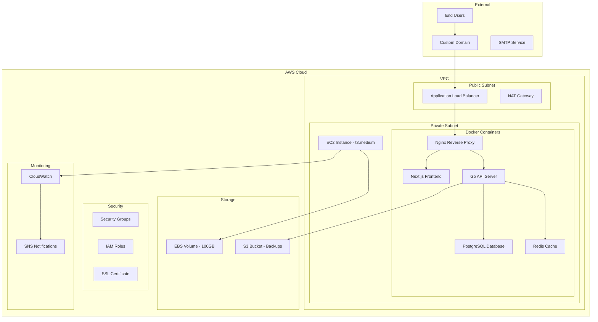

# CertiTrack - Estrategia de Despliegue y Configuración de Infraestructura

## Recuperación ante Desastres

CertiTrack está diseñado para un despliegue optimizado en costos en una única instancia EC2 de AWS utilizando contenedores Docker. Esta estrategia proporciona un equilibrio entre simplicidad, rentabilidad y escalabilidad para pequeñas organizaciones.

## Arquitectura de la Infraestructura



## Contenedores Docker

### Configuración de Docker Compose

```yaml
version: '3.8'

services:
  nginx:
    image: nginx:alpine
    container_name: certitrack-nginx
    ports:
      - "80:80"
      - "443:443"
    volumes:
      - ./nginx/nginx.conf:/etc/nginx/nginx.conf:ro
      - ./nginx/ssl:/etc/nginx/ssl:ro
      - ./storage/documents:/app/storage/documents:ro
    depends_on:
      - frontend
      - backend
    restart: unless-stopped
    networks:
      - certitrack-network

  frontend:
    build:
      context: ./frontend
      dockerfile: Dockerfile
    container_name: certitrack-frontend
    environment:
      - NODE_ENV=production
      - NEXT_PUBLIC_API_URL=https://api.certitrack.company.com
    restart: unless-stopped
    networks:
      - certitrack-network

  backend:
    build:
      context: ./backend
      dockerfile: Dockerfile
    container_name: certitrack-backend
    environment:
      - GIN_MODE=release
      - DB_HOST=postgres
      - DB_PORT=5432
      - DB_NAME=certitrack
      - DB_USER=certitrack_user
      - DB_PASSWORD=${DB_PASSWORD}
      - REDIS_URL=redis://redis:6379
      - JWT_SECRET=${JWT_SECRET}
      - SMTP_HOST=${SMTP_HOST}
      - SMTP_PORT=${SMTP_PORT}
      - SMTP_USERNAME=${SMTP_USERNAME}
      - SMTP_PASSWORD=${SMTP_PASSWORD}
    volumes:
      - ./storage:/app/storage
      - ./logs:/app/logs
    depends_on:
      - postgres
      - redis
    restart: unless-stopped
    networks:
      - certitrack-network

  postgres:
    image: postgres:15-alpine
    container_name: certitrack-postgres
    environment:
      - POSTGRES_DB=certitrack
      - POSTGRES_USER=certitrack_user
      - POSTGRES_PASSWORD=${DB_PASSWORD}
      - POSTGRES_INITDB_ARGS=--encoding=UTF-8 --lc-collate=C --lc-ctype=C
    volumes:
      - postgres_data:/var/lib/postgresql/data
      - ./database/init:/docker-entrypoint-initdb.d
      - ./database/backups:/backups
    ports:
      - "5432:5432"
    restart: unless-stopped
    networks:
      - certitrack-network

  redis:
    image: redis:7-alpine
    container_name: certitrack-redis
    command: redis-server --appendonly yes --requirepass ${REDIS_PASSWORD}
    volumes:
      - redis_data:/data
    ports:
      - "6379:6379"
    restart: unless-stopped
    networks:
      - certitrack-network

  # Background workers
  notification-worker:
    build:
      context: ./backend
      dockerfile: Dockerfile.worker
    container_name: certitrack-notification-worker
    environment:
      - GIN_MODE=release
      - DB_HOST=postgres
      - DB_PORT=5432
      - DB_NAME=certitrack
      - DB_USER=certitrack_user
      - DB_PASSWORD=${DB_PASSWORD}
      - REDIS_URL=redis://redis:6379
      - SMTP_HOST=${SMTP_HOST}
      - SMTP_PORT=${SMTP_PORT}
      - SMTP_USERNAME=${SMTP_USERNAME}
      - SMTP_PASSWORD=${SMTP_PASSWORD}
    depends_on:
      - postgres
      - redis
    restart: unless-stopped
    networks:
      - certitrack-network

volumes:
  postgres_data:
    driver: local
  redis_data:
    driver: local

networks:
  certitrack-network:
    driver: bridge
```

### Configuración de Nginx

```nginx
events {
    worker_connections 1024;
}

http {
    upstream frontend {
        server frontend:3000;
    }

    upstream backend {
        server backend:8080;
    }

    # Rate limiting
    limit_req_zone $binary_remote_addr zone=api:10m rate=10r/s;
    limit_req_zone $binary_remote_addr zone=auth:10m rate=5r/m;

    server {
        listen 80;
        server_name certitrack.company.com;
        return 301 https://$server_name$request_uri;
    }

    server {
        listen 443 ssl http2;
        server_name certitrack.company.com;

        ssl_certificate /etc/nginx/ssl/cert.pem;
        ssl_certificate_key /etc/nginx/ssl/key.pem;
        ssl_protocols TLSv1.2 TLSv1.3;
        ssl_ciphers ECDHE-RSA-AES256-GCM-SHA512:DHE-RSA-AES256-GCM-SHA512:ECDHE-RSA-AES256-GCM-SHA384:DHE-RSA-AES256-GCM-SHA384;
        ssl_prefer_server_ciphers off;

        # Security headers
        add_header X-Frame-Options DENY;
        add_header X-Content-Type-Options nosniff;
        add_header X-XSS-Protection "1; mode=block";
        add_header Strict-Transport-Security "max-age=63072000; includeSubDomains; preload";

        # Frontend routes
        location / {
            proxy_pass http://frontend;
            proxy_set_header Host $host;
            proxy_set_header X-Real-IP $remote_addr;
            proxy_set_header X-Forwarded-For $proxy_add_x_forwarded_for;
            proxy_set_header X-Forwarded-Proto $scheme;
        }

        # API routes
        location /api/ {
            limit_req zone=api burst=20 nodelay;
            
            proxy_pass http://backend;
            proxy_set_header Host $host;
            proxy_set_header X-Real-IP $remote_addr;
            proxy_set_header X-Forwarded-For $proxy_add_x_forwarded_for;
            proxy_set_header X-Forwarded-Proto $scheme;
            
            # Increase timeout for file uploads
            proxy_read_timeout 300s;
            proxy_send_timeout 300s;
        }

        # Auth routes with stricter rate limiting
        location /api/v1/auth/ {
            limit_req zone=auth burst=5 nodelay;
            
            proxy_pass http://backend;
            proxy_set_header Host $host;
            proxy_set_header X-Real-IP $remote_addr;
            proxy_set_header X-Forwarded-For $proxy_add_x_forwarded_for;
            proxy_set_header X-Forwarded-Proto $scheme;
        }

        # File downloads
        location /api/v1/certifications/*/documents/*/download {
            proxy_pass http://backend;
            proxy_set_header Host $host;
            proxy_set_header X-Real-IP $remote_addr;
            proxy_set_header X-Forwarded-For $proxy_add_x_forwarded_for;
            proxy_set_header X-Forwarded-Proto $scheme;
            
            # Enable efficient file serving
            proxy_buffering off;
            proxy_request_buffering off;
        }

        # Health check
        location /health {
            proxy_pass http://backend/api/v1/health;
            access_log off;
        }
    }
}
```

## Configuración de la Infraestructura AWS

### Configuración de la Instancia EC2

**Instance Type**: t3.medium
- **vCPUs**: 2
- **Memory**: 4 GiB
- **Network Performance**: Up to 5 Gigabit
- **Cost**: ~$30/month

**Storage**: 100 GB gp3 EBS volume
- **IOPS**: 3,000
- **Throughput**: 125 MB/s
- **Cost**: ~$8/month

### Grupos de Seguridad

```yaml
# Web Security Group
WebSecurityGroup:
  Type: AWS::EC2::SecurityGroup
  Properties:
    GroupDescription: Security group for CertiTrack web server
    VpcId: !Ref VPC
    SecurityGroupIngress:
      - IpProtocol: tcp
        FromPort: 80
        ToPort: 80
        CidrIp: 0.0.0.0/0
        Description: HTTP traffic
      - IpProtocol: tcp
        FromPort: 443
        ToPort: 443
        CidrIp: 0.0.0.0/0
        Description: HTTPS traffic
      - IpProtocol: tcp
        FromPort: 22
        ToPort: 22
        CidrIp: 10.0.0.0/8
        Description: SSH access from VPC
    SecurityGroupEgress:
      - IpProtocol: -1
        CidrIp: 0.0.0.0/0
        Description: All outbound traffic
```

### Procedimientos de Recuperación de IAM

```yaml
# EC2 Instance Role
CertiTrackInstanceRole:
  Type: AWS::IAM::Role
  Properties:
    AssumeRolePolicyDocument:
      Version: '2012-10-17'
      Statement:
        - Effect: Allow
          Principal:
            Service: ec2.amazonaws.com
          Action: sts:AssumeRole
    ManagedPolicyArns:
      - arn:aws:iam::aws:policy/CloudWatchAgentServerPolicy
    Policies:
      - PolicyName: S3BackupAccess
        PolicyDocument:
          Version: '2012-10-17'
          Statement:
            - Effect: Allow
              Action:
                - s3:GetObject
                - s3:PutObject
                - s3:DeleteObject
              Resource: !Sub "${BackupBucket}/*"
            - Effect: Allow
              Action:
                - s3:ListBucket
              Resource: !Ref BackupBucket
```

## Proceso de Despliegue

### Renovación Automática de Certificados

```bash
#!/bin/bash
set -e

# Configuration
INSTANCE_IP="your-ec2-instance-ip"
KEY_PATH="~/.ssh/certitrack-key.pem"
DEPLOY_USER="ubuntu"

echo "Starting CertiTrack deployment..."

# 1. Build and push Docker images (if using registry)
echo "Building Docker images..."
docker build -t certitrack-frontend:latest ./frontend
docker build -t certitrack-backend:latest ./backend

# 2. Create deployment package
echo "Creating deployment package..."
tar -czf deployment.tar.gz \
    docker-compose.yml \
    nginx/ \
    .env.production \
    database/init/ \
    scripts/

# 3. Upload to server
echo "Uploading to server..."
scp -i $KEY_PATH deployment.tar.gz $DEPLOY_USER@$INSTANCE_IP:/tmp/

# 4. Deploy on server
echo "Deploying on server..."
ssh -i $KEY_PATH $DEPLOY_USER@$INSTANCE_IP << 'EOF'
    cd /opt/certitrack
    
    # Backup current deployment
    if [ -d "current" ]; then
        mv current backup-$(date +%Y%m%d-%H%M%S)
    fi
    
    # Extract new deployment
    mkdir -p current
    cd current
    tar -xzf /tmp/deployment.tar.gz
    
    # Load environment variables
    cp .env.production .env
    
    # Pull latest images and restart services
    docker-compose pull
    docker-compose down
    docker-compose up -d
    
    # Wait for services to be healthy
    sleep 30
    
    # Run health check
    curl -f http://localhost/health || exit 1
    
    echo "Deployment completed successfully!"
EOF

echo "Deployment finished!"
```

### Script de Migración de Base de Datos

```bash
#!/bin/bash
# database/migrate.sh

set -e

DB_CONTAINER="certitrack-postgres"
BACKUP_DIR="/opt/certitrack/database/backups"

echo "Starting database migration..."

# Create backup before migration
echo "Creating database backup..."
docker exec $DB_CONTAINER pg_dump -U certitrack_user certitrack > "$BACKUP_DIR/backup-$(date +%Y%m%d-%H%M%S).sql"

# Run migrations
echo "Running database migrations..."
docker exec certitrack-backend /app/migrate

echo "Database migration completed!"
```

## Configuración del Entorno

### Variables de Entorno de Producción

```env
# .env.production

# Database Configuration
DB_PASSWORD=your-secure-database-password
POSTGRES_PASSWORD=your-secure-database-password

# Redis Configuration
REDIS_PASSWORD=your-secure-redis-password

# JWT Configuration
JWT_SECRET=your-super-secret-jwt-key-minimum-32-characters

# SMTP Configuration
SMTP_HOST=smtp.gmail.com
SMTP_PORT=587
SMTP_USERNAME=notifications@company.com
SMTP_PASSWORD=your-app-specific-password

# Application Configuration
APP_ENV=production
APP_URL=https://certitrack.company.com
API_URL=https://certitrack.company.com/api

# File Storage
STORAGE_ROOT=/app/storage
MAX_FILE_SIZE_MB=10

# Backup Configuration
S3_BACKUP_BUCKET=certitrack-backups-your-account-id
AWS_REGION=us-east-1

# Monitoring
ENABLE_METRICS=true
LOG_LEVEL=info
```

## Monitoreo y Registro

### Configuración de CloudWatch

```yaml
# CloudWatch Log Groups
ApplicationLogGroup:
  Type: AWS::Logs::LogGroup
  Properties:
    LogGroupName: /aws/ec2/certitrack/application
    RetentionInDays: 30

NginxLogGroup:
  Type: AWS::Logs::LogGroup
  Properties:
    LogGroupName: /aws/ec2/certitrack/nginx
    RetentionInDays: 30

DatabaseLogGroup:
  Type: AWS::Logs::LogGroup
  Properties:
    LogGroupName: /aws/ec2/certitrack/database
    RetentionInDays: 7
```

### Alarmas de CloudWatch

```yaml
# High CPU Utilization
HighCPUAlarm:
  Type: AWS::CloudWatch::Alarm
  Properties:
    AlarmDescription: High CPU utilization
    MetricName: CPUUtilization
    Namespace: AWS/EC2
    Statistic: Average
    Period: 300
    EvaluationPeriods: 2
    Threshold: 80
    ComparisonOperator: GreaterThanThreshold
    AlarmActions:
      - !Ref SNSAlert

# Low Disk Space
LowDiskSpaceAlarm:
  Type: AWS::CloudWatch::Alarm
  Properties:
    AlarmDescription: Low disk space
    MetricName: DiskSpaceUtilization
    Namespace: CWAgent
    Statistic: Average
    Period: 300
    EvaluationPeriods: 1
    Threshold: 85
    ComparisonOperator: GreaterThanThreshold
    AlarmActions:
      - !Ref SNSAlert

# Application Health Check
HealthCheckAlarm:
  Type: AWS::CloudWatch::Alarm
  Properties:
    AlarmDescription: Application health check failed
    MetricName: HealthCheck
    Namespace: CertiTrack
    Statistic: Average
    Period: 60
    EvaluationPeriods: 3
    Threshold: 1
    ComparisonOperator: LessThanThreshold
    AlarmActions:
      - !Ref SNSAlert
```

## Estrategia de Copias de Seguridad

### Script Automatizado de Copias de Seguridad

```bash
#!/bin/bash
# scripts/backup.sh

set -e

BACKUP_DIR="/opt/certitrack/backups"
S3_BUCKET="certitrack-backups-your-account-id"
DATE=$(date +%Y%m%d-%H%M%S)

echo "Starting backup process..."

# Create backup directory
mkdir -p "$BACKUP_DIR/$DATE"

# Database backup
echo "Backing up database..."
docker exec certitrack-postgres pg_dump -U certitrack_user certitrack | gzip > "$BACKUP_DIR/$DATE/database.sql.gz"

# File storage backup
echo "Backing up file storage..."
tar -czf "$BACKUP_DIR/$DATE/storage.tar.gz" -C /opt/certitrack/storage .

# Configuration backup
echo "Backing up configuration..."
cp /opt/certitrack/current/.env "$BACKUP_DIR/$DATE/"
cp /opt/certitrack/current/docker-compose.yml "$BACKUP_DIR/$DATE/"

# Upload to S3
echo "Uploading to S3..."
aws s3 sync "$BACKUP_DIR/$DATE" "s3://$S3_BUCKET/backups/$DATE/"

# Cleanup old local backups (keep last 7 days)
find "$BACKUP_DIR" -type d -mtime +7 -exec rm -rf {} +

# Cleanup old S3 backups (keep last 30 days)
aws s3 ls "s3://$S3_BUCKET/backups/" | while read -r line; do
    backup_date=$(echo $line | awk '{print $2}' | sed 's/\///')
    if [[ $backup_date < $(date -d '30 days ago' +%Y%m%d-%H%M%S) ]]; then
        aws s3 rm "s3://$S3_BUCKET/backups/$backup_date/" --recursive
    fi
done

echo "Backup completed successfully!"
```

### Cron Job Configuration

```bash
# Add to crontab
# Daily backup at 2 AM
0 2 * * * /opt/certitrack/scripts/backup.sh >> /var/log/certitrack-backup.log 2>&1

# Weekly full system backup at 3 AM on Sundays
0 3 * * 0 /opt/certitrack/scripts/full-backup.sh >> /var/log/certitrack-backup.log 2>&1

# Log rotation
0 0 * * * /usr/sbin/logrotate /opt/certitrack/config/logrotate.conf
```

## Gestión de Certificados SSL

### Let's Encrypt con Certbot

```bash
#!/bin/bash
# scripts/setup-ssl.sh

# Install certbot
sudo apt-get update
sudo apt-get install -y certbot

# Stop nginx temporarily
docker-compose stop nginx

# Obtain certificate
sudo certbot certonly --standalone \
    --email admin@company.com \
    --agree-tos \
    --no-eff-email \
    -d certitrack.company.com

# Copy certificates to nginx directory
sudo cp /etc/letsencrypt/live/certitrack.company.com/fullchain.pem /opt/certitrack/nginx/ssl/cert.pem
sudo cp /etc/letsencrypt/live/certitrack.company.com/privkey.pem /opt/certitrack/nginx/ssl/key.pem

# Set proper permissions
sudo chown root:root /opt/certitrack/nginx/ssl/*
sudo chmod 600 /opt/certitrack/nginx/ssl/*

# Restart nginx
docker-compose start nginx

# Setup auto-renewal
echo "0 12 * * * /usr/bin/certbot renew --quiet && docker-compose restart nginx" | sudo crontab -
```

## Estimación de Costos

### Costos Mensuales en AWS

| Servicio | Configuración | Costo Mensual |
|---------|---------------|--------------|
| EC2 t3.medium | Operación 24/7 | $30.37 |
| EBS gp3 100GB | 3,000 IOPS, 125 MB/s | $8.00 |
| Transferencia de Datos | 100 GB salientes | $9.00 |
| Almacenamiento S3 | 50 GB de copias de seguridad | $1.15 |
| CloudWatch | Registros y métricas | $5.00 |
| **Total** | | **~$53.52** |

### Consideraciones de Escalabilidad

**Opciones de Escalamiento Vertical:**
- t3.large (4 vCPU, 8 GB RAM): +$30/mes
- t3.xlarge (4 vCPU, 16 GB RAM): +$60/mes

**Ruta de Escalamiento Horizontal:**
- Añadir Application Load Balancer: +$16/mes
- Añadir segunda instancia EC2: +$53/mes
- RDS PostgreSQL (db.t3.micro): +$13/mes

Esta estrategia de despliegue proporciona una base sólida y rentable para CertiTrack, manteniendo la flexibilidad para escalar a medida que la organización crece.