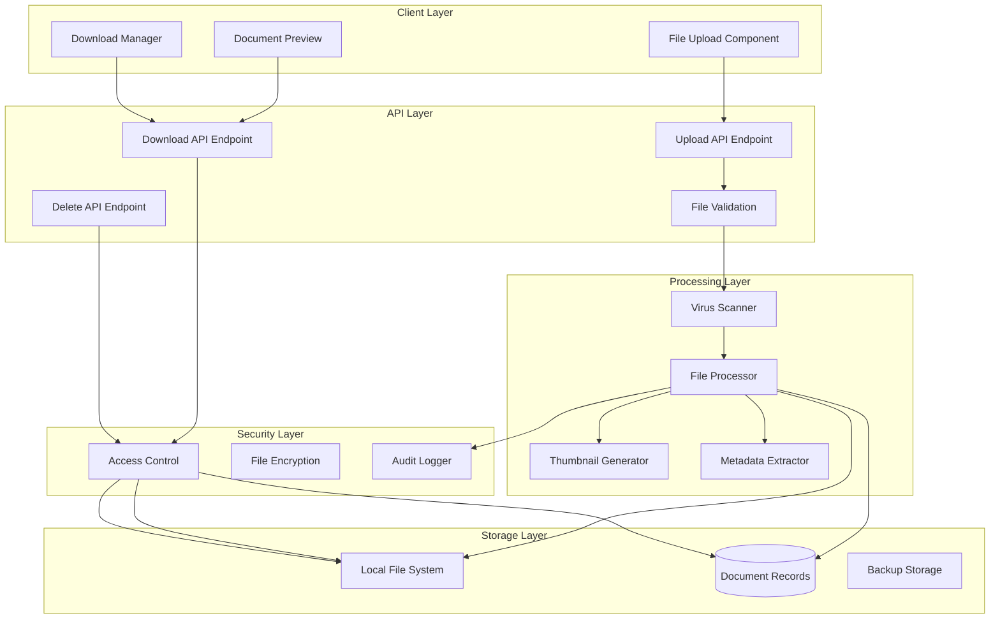

# CertiTrack - Sistema de Carga de Archivos y Gestión de Documentos

## Visión General

El sistema de gestión de archivos de CertiTrack maneja la carga, almacenamiento y recuperación segura de documentos de certificación. Soporta múltiples formatos de archivo con validación, escaneo de virus y control de acceso, manteniendo registros de auditoría.

## Arquitectura del Sistema



## Estrategia de Almacenamiento de Archivos

### Estructura de Directorios
```
/app/storage/
├── documents/
│   ├── certifications/
│   │   ├── 2024/
│   │   │   ├── 01/
│   │   │   │   ├── cert-uuid-1/
│   │   │   │   │   ├── original_filename.pdf
│   │   │   │   │   ├── thumbnail.jpg
│   │   │   │   │   └── metadata.json
│   │   │   │   └── cert-uuid-2/
│   │   │   └── 02/
│   │   └── 2025/
│   ├── temp/
│   │   └── uploads/
│   └── quarantine/
├── backups/
└── logs/
```

### Convención de Nombres de Archivo
- **Archivos Originales**: `{uuid}_{sanitized_filename}.{extension}`
- **Miniaturas**: `{uuid}_thumb.jpg`
- **Metadatos**: `{uuid}_meta.json`

## Implementación de Carga de Archivos

### Componente de Carga en Frontend (React)

```typescript
interface FileUploadProps {
  certificationId: string;
  onUploadComplete: (documents: Document[]) => void;
  onUploadError: (error: string) => void;
  maxFiles?: number;
  maxSizeBytes?: number;
}

const FileUpload: React.FC<FileUploadProps> = ({
  certificationId,
  onUploadComplete,
  onUploadError,
  maxFiles = 5,
  maxSizeBytes = 10 * 1024 * 1024 // 10MB
}) => {
  const [uploading, setUploading] = useState(false);
  const [progress, setProgress] = useState<Record<string, number>>({});
  const [dragActive, setDragActive] = useState(false);

  const handleFiles = async (files: FileList) => {
    const validFiles = Array.from(files).filter(file => {
      // Validate file type
      const allowedTypes = [
        'application/pdf',
        'image/jpeg',
        'image/png',
        'image/gif',
        'application/msword',
        'application/vnd.openxmlformats-officedocument.wordprocessingml.document'
      ];
      
      if (!allowedTypes.includes(file.type)) {
        onUploadError(`File type ${file.type} not allowed`);
        return false;
      }
      
      // Validate file size
      if (file.size > maxSizeBytes) {
        onUploadError(`File ${file.name} exceeds maximum size of ${maxSizeBytes / 1024 / 1024}MB`);
        return false;
      }
      
      return true;
    });

    if (validFiles.length === 0) return;

    setUploading(true);
    
    try {
      const uploadPromises = validFiles.map(file => uploadFile(file));
      const results = await Promise.all(uploadPromises);
      onUploadComplete(results);
    } catch (error) {
      onUploadError(error.message);
    } finally {
      setUploading(false);
      setProgress({});
    }
  };

  const uploadFile = async (file: File): Promise<Document> => {
    const formData = new FormData();
    formData.append('file', file);
    formData.append('description', ''); // Optional description

    return new Promise((resolve, reject) => {
      const xhr = new XMLHttpRequest();
      
      xhr.upload.addEventListener('progress', (e) => {
        if (e.lengthComputable) {
          const percentComplete = (e.loaded / e.total) * 100;
          setProgress(prev => ({ ...prev, [file.name]: percentComplete }));
        }
      });

      xhr.addEventListener('load', () => {
        if (xhr.status === 200) {
          const response = JSON.parse(xhr.responseText);
          resolve(response.data);
        } else {
          reject(new Error(`Upload failed: ${xhr.statusText}`));
        }
      });

      xhr.addEventListener('error', () => {
        reject(new Error('Upload failed'));
      });

      xhr.open('POST', `/api/v1/certifications/${certificationId}/documents`);
      xhr.setRequestHeader('Authorization', `Bearer ${getAccessToken()}`);
      xhr.send(formData);
    });
  };

  const handleDrop = (e: React.DragEvent) => {
    e.preventDefault();
    setDragActive(false);
    handleFiles(e.dataTransfer.files);
  };

  const handleDragOver = (e: React.DragEvent) => {
    e.preventDefault();
    setDragActive(true);
  };

  const handleDragLeave = () => {
    setDragActive(false);
  };

  return (
    <div
      className={`border-2 border-dashed rounded-lg p-6 text-center transition-colors ${
        dragActive ? 'border-blue-500 bg-blue-50' : 'border-gray-300'
      }`}
      onDrop={handleDrop}
      onDragOver={handleDragOver}
      onDragLeave={handleDragLeave}
    >
      {uploading ? (
        <div>
          <div className="mb-4">Uploading files...</div>
          {Object.entries(progress).map(([filename, percent]) => (
            <div key={filename} className="mb-2">
              <div className="text-sm text-gray-600">{filename}</div>
              <div className="w-full bg-gray-200 rounded-full h-2">
                <div
                  className="bg-blue-600 h-2 rounded-full transition-all"
                  style={{ width: `${percent}%` }}
                />
              </div>
            </div>
          ))}
        </div>
      ) : (
        <div>
          <div className="mb-4">
            <svg className="mx-auto h-12 w-12 text-gray-400" fill="none" viewBox="0 0 24 24" stroke="currentColor">
              <path strokeLinecap="round" strokeLinejoin="round" strokeWidth={2} d="M7 16a4 4 0 01-.88-7.903A5 5 0 1115.9 6L16 6a5 5 0 011 9.9M15 13l-3-3m0 0l-3 3m3-3v12" />
            </svg>
          </div>
          <div className="text-lg font-medium text-gray-900 mb-2">
            Drop files here or click to browse
          </div>
          <div className="text-sm text-gray-500">
            Supports PDF, DOC, DOCX, JPG, PNG, GIF up to {maxSizeBytes / 1024 / 1024}MB
          </div>
          <input
            type="file"
            multiple
            accept=".pdf,.doc,.docx,.jpg,.jpeg,.png,.gif"
            onChange={(e) => e.target.files && handleFiles(e.target.files)}
            className="hidden"
            id="file-upload"
          />
          <label
            htmlFor="file-upload"
            className="mt-4 inline-flex items-center px-4 py-2 border border-transparent text-sm font-medium rounded-md text-white bg-blue-600 hover:bg-blue-700 cursor-pointer"
          >
            Select Files
          </label>
        </div>
      )}
    </div>
  );
};
```

### Manejador de Carga en Backend (Go)

```go
type FileService interface {
    UploadDocument(certificationID uuid.UUID, file *multipart.FileHeader, userID uuid.UUID) (*models.CertificationDocument, error)
    GetDocument(documentID uuid.UUID, userID uuid.UUID) (*models.CertificationDocument, error)
    DownloadDocument(documentID uuid.UUID, userID uuid.UUID) (io.ReadCloser, error)
    DeleteDocument(documentID uuid.UUID, userID uuid.UUID) error
    GetDocumentsByCertification(certificationID uuid.UUID) ([]*models.CertificationDocument, error)
}

type fileService struct {
    db           *gorm.DB
    storageRoot  string
    virusScanner VirusScanner
    logger       *logrus.Logger
}

func (fs *fileService) UploadDocument(certificationID uuid.UUID, fileHeader *multipart.FileHeader, userID uuid.UUID) (*models.CertificationDocument, error) {
    // Validate file
    if err := fs.validateFile(fileHeader); err != nil {
        return nil, fmt.Errorf("file validation failed: %w", err)
    }

    // Open uploaded file
    file, err := fileHeader.Open()
    if err != nil {
        return nil, fmt.Errorf("failed to open uploaded file: %w", err)
    }
    defer file.Close()

    // Read file content for processing
    content, err := io.ReadAll(file)
    if err != nil {
        return nil, fmt.Errorf("failed to read file content: %w", err)
    }

    // Virus scan
    if err := fs.virusScanner.ScanBytes(content); err != nil {
        fs.logger.WithError(err).Warn("Virus detected in uploaded file")
        return nil, fmt.Errorf("file failed security scan")
    }

    // Generate file paths
    docID := uuid.New()
    filePath := fs.generateFilePath(certificationID, docID, fileHeader.Filename)
    
    // Ensure directory exists
    if err := os.MkdirAll(filepath.Dir(filePath), 0755); err != nil {
        return nil, fmt.Errorf("failed to create directory: %w", err)
    }

    // Save file to disk
    if err := fs.saveFile(filePath, content); err != nil {
        return nil, fmt.Errorf("failed to save file: %w", err)
    }

    // Generate thumbnail if image
    thumbnailPath := ""
    if fs.isImage(fileHeader.Filename) {
        thumbnailPath, err = fs.generateThumbnail(filePath, docID)
        if err != nil {
            fs.logger.WithError(err).Warn("Failed to generate thumbnail")
        }
    }

    // Extract metadata
    metadata := fs.extractMetadata(fileHeader, content)

    // Create database record
    document := &models.CertificationDocument{
        ID:              docID,
        CertificationID: certificationID,
        FileName:        fileHeader.Filename,
        FilePath:        filePath,
        ThumbnailPath:   thumbnailPath,
        FileSize:        int(fileHeader.Size),
        MimeType:        fs.detectMimeType(content),
        Metadata:        metadata,
        UploadedBy:      userID,
        UploadedAt:      time.Now(),
    }

    if err := fs.db.Create(document).Error; err != nil {
        // Clean up file if database save fails
        os.Remove(filePath)
        if thumbnailPath != "" {
            os.Remove(thumbnailPath)
        }
        return nil, fmt.Errorf("failed to save document record: %w", err)
    }

    // Log upload
    fs.logger.WithFields(logrus.Fields{
        "document_id":      document.ID,
        "certification_id": certificationID,
        "filename":        fileHeader.Filename,
        "size":           fileHeader.Size,
        "user_id":        userID,
    }).Info("Document uploaded successfully")

    return document, nil
}

func (fs *fileService) validateFile(fileHeader *multipart.FileHeader) error {
    // Check file size (10MB limit)
    maxSize := int64(10 * 1024 * 1024)
    if fileHeader.Size > maxSize {
        return fmt.Errorf("file size %d exceeds maximum allowed size %d", fileHeader.Size, maxSize)
    }

    // Check file extension
    allowedExtensions := []string{".pdf", ".doc", ".docx", ".jpg", ".jpeg", ".png", ".gif"}
    ext := strings.ToLower(filepath.Ext(fileHeader.Filename))
    
    for _, allowed := range allowedExtensions {
        if ext == allowed {
            return nil
        }
    }
    
    return fmt.Errorf("file extension %s not allowed", ext)
}

func (fs *fileService) generateFilePath(certificationID, documentID uuid.UUID, filename string) string {
    now := time.Now()
    year := now.Format("2006")
    month := now.Format("01")
    
    sanitizedFilename := fs.sanitizeFilename(filename)
    finalFilename := fmt.Sprintf("%s_%s", documentID.String(), sanitizedFilename)
    
    return filepath.Join(
        fs.storageRoot,
        "documents",
        "certifications",
        year,
        month,
        certificationID.String(),
        finalFilename,
    )
}

func (fs *fileService) sanitizeFilename(filename string) string {
    // Remove or replace dangerous characters
    reg := regexp.MustCompile(`[^a-zA-Z0-9._-]`)
    sanitized := reg.ReplaceAllString(filename, "_")
    
    // Limit length
    if len(sanitized) > 100 {
        ext := filepath.Ext(sanitized)
        name := sanitized[:100-len(ext)]
        sanitized = name + ext
    }
    
    return sanitized
}
```

## Seguridad y Control de Acceso a Archivos

### Implementación de Control de Acceso

```go
func (fs *fileService) DownloadDocument(documentID uuid.UUID, userID uuid.UUID) (io.ReadCloser, error) {
    // Get document record
    var document models.CertificationDocument
    err := fs.db.Preload("Certification").First(&document, documentID).Error
    if err != nil {
        return nil, fmt.Errorf("document not found: %w", err)
    }

    // Check access permissions
    if !fs.canAccessDocument(&document, userID) {
        return nil, fmt.Errorf("access denied")
    }

    // Open file
    file, err := os.Open(document.FilePath)
    if err != nil {
        return nil, fmt.Errorf("failed to open file: %w", err)
    }

    // Log access
    fs.logger.WithFields(logrus.Fields{
        "document_id": documentID,
        "user_id":    userID,
        "filename":   document.FileName,
    }).Info("Document accessed")

    return file, nil
}

func (fs *fileService) canAccessDocument(document *models.CertificationDocument, userID uuid.UUID) bool {
    // Get user role
    var user models.User
    if err := fs.db.First(&user, userID).Error; err != nil {
        return false
    }

    // Admins can access all documents
    if user.Role == "admin" {
        return true
    }

    // Regular users can access documents for certifications they can view
    // This would integrate with the authorization system
    return fs.canViewCertification(document.CertificationID, userID)
}
```

### Cifrado de Archivos (Mejora Opcional)

```go
type EncryptionService interface {
    EncryptFile(filePath string) error
    DecryptFile(filePath string) ([]byte, error)
}

func (fs *fileService) saveFileEncrypted(filePath string, content []byte) error {
    // Encrypt content before saving
    encryptedContent, err := fs.encryptionService.Encrypt(content)
    if err != nil {
        return fmt.Errorf("encryption failed: %w", err)
    }

    return os.WriteFile(filePath, encryptedContent, 0644)
}
```

## Integración de Escaneo de Virus

### Integración con ClamAV

```go
type VirusScanner interface {
    ScanBytes(content []byte) error
    ScanFile(filePath string) error
    IsHealthy() bool
}

type clamAVScanner struct {
    socketPath string
    timeout    time.Duration
}

func (c *clamAVScanner) ScanBytes(content []byte) error {
    conn, err := net.DialTimeout("unix", c.socketPath, c.timeout)
    if err != nil {
        return fmt.Errorf("failed to connect to ClamAV: %w", err)
    }
    defer conn.Close()

    // Send INSTREAM command
    _, err = conn.Write([]byte("zINSTREAM\000"))
    if err != nil {
        return fmt.Errorf("failed to send command: %w", err)
    }

    // Send file size
    size := uint32(len(content))
    sizeBytes := make([]byte, 4)
    binary.BigEndian.PutUint32(sizeBytes, size)
    
    _, err = conn.Write(sizeBytes)
    if err != nil {
        return fmt.Errorf("failed to send size: %w", err)
    }

    // Send file content
    _, err = conn.Write(content)
    if err != nil {
        return fmt.Errorf("failed to send content: %w", err)
    }

    // Send end marker
    _, err = conn.Write([]byte{0, 0, 0, 0})
    if err != nil {
        return fmt.Errorf("failed to send end marker: %w", err)
    }

    // Read response
    response := make([]byte, 1024)
    n, err := conn.Read(response)
    if err != nil {
        return fmt.Errorf("failed to read response: %w", err)
    }

    responseStr := string(response[:n])
    if strings.Contains(responseStr, "FOUND") {
        return fmt.Errorf("virus detected: %s", responseStr)
    }

    return nil
}
```

## Generación de Miniaturas

### Generación de Miniaturas de Imágenes

```go
func (fs *fileService) generateThumbnail(filePath string, documentID uuid.UUID) (string, error) {
    // Open original image
    file, err := os.Open(filePath)
    if err != nil {
        return "", err
    }
    defer file.Close()

    // Decode image
    img, _, err := image.Decode(file)
    if err != nil {
        return "", err
    }

    // Resize to thumbnail
    thumbnail := resize.Thumbnail(200, 200, img, resize.Lanczos3)

    // Generate thumbnail path
    thumbnailPath := strings.Replace(filePath, filepath.Ext(filePath), "_thumb.jpg", 1)

    // Create thumbnail file
    thumbnailFile, err := os.Create(thumbnailPath)
    if err != nil {
        return "", err
    }
    defer thumbnailFile.Close()

    // Encode as JPEG
    err = jpeg.Encode(thumbnailFile, thumbnail, &jpeg.Options{Quality: 80})
    if err != nil {
        return "", err
    }

    return thumbnailPath, nil
}

func (fs *fileService) isImage(filename string) bool {
    ext := strings.ToLower(filepath.Ext(filename))
    imageExtensions := []string{".jpg", ".jpeg", ".png", ".gif"}
    
    for _, imgExt := range imageExtensions {
        if ext == imgExt {
            return true
        }
    }
    
    return false
}
```

## Extracción de Metadatos

### Extracción de Metadatos de Archivos

```go
type FileMetadata struct {
    CreatedAt    *time.Time `json:"createdAt,omitempty"`
    ModifiedAt   *time.Time `json:"modifiedAt,omitempty"`
    Author       string     `json:"author,omitempty"`
    Title        string     `json:"title,omitempty"`
    Subject      string     `json:"subject,omitempty"`
    Keywords     []string   `json:"keywords,omitempty"`
    PageCount    int        `json:"pageCount,omitempty"`
    ImageWidth   int        `json:"imageWidth,omitempty"`
    ImageHeight  int        `json:"imageHeight,omitempty"`
    ColorSpace   string     `json:"colorSpace,omitempty"`
}

func (fs *fileService) extractMetadata(fileHeader *multipart.FileHeader, content []byte) FileMetadata {
    metadata := FileMetadata{}
    
    // Basic file info
    if stat, err := os.Stat(fileHeader.Filename); err == nil {
        modTime := stat.ModTime()
        metadata.ModifiedAt = &modTime
    }

    // Extract based on file type
    mimeType := fs.detectMimeType(content)
    
    switch mimeType {
    case "application/pdf":
        fs.extractPDFMetadata(content, &metadata)
    case "image/jpeg", "image/png", "image/gif":
        fs.extractImageMetadata(content, &metadata)
    }

    return metadata
}

func (fs *fileService) extractImageMetadata(content []byte, metadata *FileMetadata) {
    reader := bytes.NewReader(content)
    config, _, err := image.DecodeConfig(reader)
    if err == nil {
        metadata.ImageWidth = config.Width
        metadata.ImageHeight = config.Height
        metadata.ColorSpace = config.ColorModel.String()
    }
}
```

## Respaldo y Recuperación

### Estrategia de Respaldo

```go
type BackupService interface {
    BackupDocument(documentID uuid.UUID) error
    RestoreDocument(documentID uuid.UUID) error
    ScheduleBackups() error
}

func (bs *backupService) BackupDocument(documentID uuid.UUID) error {
    // Get document record
    var document models.CertificationDocument
    err := bs.db.First(&document, documentID).Error
    if err != nil {
        return err
    }

    // Create backup path
    backupPath := filepath.Join(
        bs.backupRoot,
        time.Now().Format("2006/01/02"),
        document.ID.String(),
    )

    // Ensure backup directory exists
    if err := os.MkdirAll(filepath.Dir(backupPath), 0755); err != nil {
        return err
    }

    // Copy file to backup location
    return fs.copyFile(document.FilePath, backupPath)
}
```

## Configuración

### Variables de Entorno

```env
# File Storage Configuration
STORAGE_ROOT=/app/storage
MAX_FILE_SIZE_MB=10
ALLOWED_FILE_TYPES=pdf,doc,docx,jpg,jpeg,png,gif
ENABLE_VIRUS_SCANNING=true
ENABLE_THUMBNAILS=true
ENABLE_FILE_ENCRYPTION=false

# ClamAV Configuration
CLAMAV_SOCKET_PATH=/var/run/clamav/clamd.ctl
CLAMAV_TIMEOUT=30s

# Backup Configuration
BACKUP_ENABLED=true
BACKUP_ROOT=/app/backups
BACKUP_SCHEDULE=0 2 * * * # Daily at 2 AM
BACKUP_RETENTION_DAYS=90
```

## Resumen de Endpoints de la API

### Endpoints de Gestión de Documentos

```go
// Upload document
POST /api/v1/certifications/{id}/documents
Content-Type: multipart/form-data

// Get documents for certification
GET /api/v1/certifications/{id}/documents

// Download document
GET /api/v1/certifications/{certId}/documents/{docId}

// Delete document
DELETE /api/v1/certifications/{certId}/documents/{docId}

// Get document metadata
GET /api/v1/certifications/{certId}/documents/{docId}/metadata
```

Este sistema de gestión de archivos proporciona un manejo de documentos seguro y escalable con validación integral, escaneo de virus y control de acceso, manteniendo registros de auditoría y soportando mejoras futuras como la integración con almacenamiento en la nube.