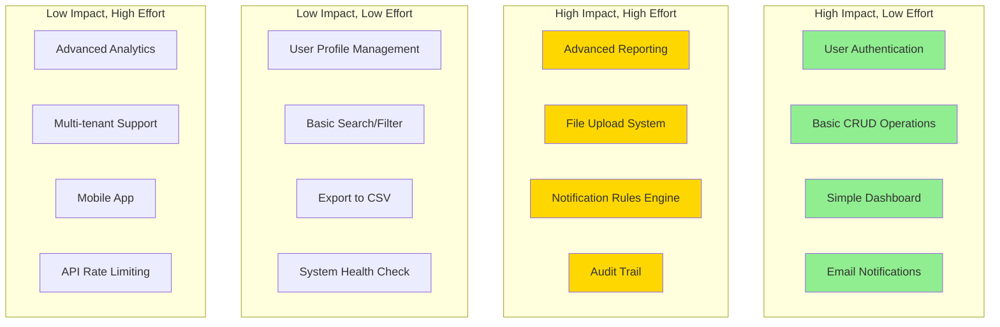
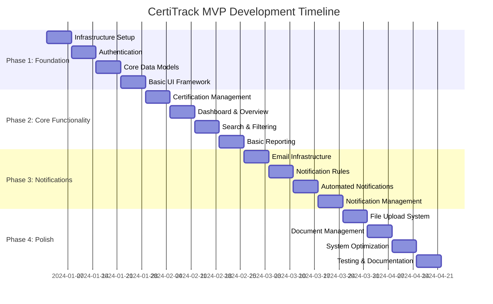

# CertiTrack - Priorización de Características y Fases de Desarrollo del MVP

## Visión General

Este documento describe el plan de desarrollo del Producto Mínimo Viable (MVP) para CertiTrack, incluyendo la priorización de características, fases de desarrollo, estimaciones de tiempo y criterios de éxito. El MVP se enfoca en la funcionalidad central de gestión de certificaciones mientras establece una base para futuras mejoras.

## Definición del Alcance del MVP

### Propuesta de Valor Principal
El MVP de CertiTrack ofrece capacidades esenciales de seguimiento y notificación de certificaciones para pequeñas organizaciones, asegurando el cumplimiento y previniendo el vencimiento de certificaciones a través de alertas automatizadas.

### Usuarios Objetivo
- **Principal**: Pequeñas organizaciones (50-200 empleados)
- **Roles de Usuario**: Administradores y Usuarios Regulares
- **Casos de Uso**: Certificaciones de seguridad, licencias profesionales, certificaciones de equipos

### Métricas de Éxito
- **Adopción de Usuarios**: 80% de los usuarios objetivo utilizando activamente el sistema en 30 días
- **Seguimiento de Certificaciones**: 100% de las certificaciones activas ingresadas y monitoreadas
- **Efectividad de Notificaciones**: 95% de las certificaciones vencidas renovadas a tiempo
- **Confiabilidad del Sistema**: 99% de tiempo de actividad con tiempos de respuesta <2 segundos

## Feature Prioritization Matrix

## Fases de Desarrollo

### Fase 1: Fundación (Semanas 1-4)
**Objetivo**: Establecer la infraestructura central y la funcionalidad básica

#### Sprint 1.1: Configuración de Infraestructura (Semana 1)
**Entregables:**
- [ ] Configuración del repositorio del proyecto con estructura adecuada
- [ ] Configuración del entorno de desarrollo
- [ ] Implementación de la canalización CI/CD
- [ ] Creación del esquema de base de datos y migraciones iniciales
- [ ] Configuración de contenedores Docker

**Criterios de Aceptación:**
- El entorno de desarrollo se ejecuta localmente con todos los servicios
- La canalización CI/CD ejecuta pruebas y construye exitosamente
- Las migraciones de base de datos se ejecutan sin errores
- Todos los contenedores inician y se comunican correctamente

#### Sprint 1.2: Authentication & User Management (Week 2)
**Deliverables:**
- [ ] User registration and login functionality
- [ ] JWT-based authentication system
- [ ] Password security implementation
- [ ] Basic user profile management
- [ ] Role-based access control (Admin/User)

**Acceptance Criteria:**
- Users can register, login, and logout securely
- JWT tokens expire and refresh properly
- Password requirements enforced
- Admin users can manage other users
- Session management works correctly

#### Sprint 1.3: Core Data Models (Week 3)
**Deliverables:**
- [ ] People management (CRUD operations)
- [ ] Equipment management (CRUD operations)
- [ ] Certification types management
- [ ] Basic data validation and sanitization
- [ ] Database relationships and constraints

**Acceptance Criteria:**
- All CRUD operations work for people and equipment
- Data validation prevents invalid entries
- Database relationships maintain referential integrity
- Soft delete functionality implemented
- Audit fields (created_at, updated_at) populated

#### Sprint 1.4: Basic UI Framework (Week 4)
**Deliverables:**
- [ ] Next.js application setup with routing
- [ ] UI component library implementation
- [ ] Responsive layout and navigation
- [ ] Basic forms for data entry
- [ ] Error handling and loading states

**Acceptance Criteria:**
- Application loads and navigates properly
- Forms validate input and show errors
- Responsive design works on mobile and desktop
- Loading states provide user feedback
- Error messages are user-friendly

### Fase 2: Funcionalidad Principal (Semanas 5-8)
**Objetivo**: Implementar las características principales de gestión de certificaciones

#### Sprint 2.1: Certification Management (Week 5)
**Deliverables:**
- [ ] Certification CRUD operations
- [ ] Link certifications to people/equipment
- [ ] Certification status management
- [ ] Expiration date calculations
- [ ] Basic certification listing and filtering

**Acceptance Criteria:**
- Certifications can be created, viewed, updated, deleted
- Certifications properly link to people or equipment
- Status updates reflect current state
- Expiration calculations are accurate
- List view shows relevant information clearly

#### Sprint 2.2: Dashboard & Overview (Week 6)
**Deliverables:**
- [ ] Dashboard with key metrics
- [ ] Expiring certifications widget
- [ ] Recent activity feed
- [ ] Quick action buttons
- [ ] Status indicators and alerts

**Acceptance Criteria:**
- Dashboard loads quickly with accurate data
- Expiring certifications prominently displayed
- Metrics update in real-time
- Quick actions work from dashboard
- Visual indicators clearly show status

#### Sprint 2.3: Search & Filtering (Week 7)
**Deliverables:**
- [ ] Global search functionality
- [ ] Advanced filtering options
- [ ] Sorting capabilities
- [ ] Pagination implementation
- [ ] Search result highlighting

**Acceptance Criteria:**
- Search returns relevant results quickly
- Filters work independently and in combination
- Sorting works on all relevant columns
- Pagination handles large datasets
- Search terms are highlighted in results

#### Sprint 2.4: Basic Reporting (Week 8)
**Deliverables:**
- [ ] Certification status reports
- [ ] Informes de línea de tiempo de vencimientos
- [ ] Funcionalidad de exportación a CSV
- [ ] Diseños de informes aptos para impresión
- [ ] Gráficos y visualizaciones básicas

**Criterios de Aceptación:**
- Los informes generan datos precisos
- La funcionalidad de exportación funciona de manera confiable
- Los informes son legibles y están bien formateados
- Los gráficos muestran información significativa
- El rendimiento es aceptable para los volúmenes de datos esperados

### Fase 3: Notificaciones y Automatización (Semanas 9-12)
**Objetivo**: Implementar el sistema de notificaciones automatizadas

#### Sprint 3.1: Infraestructura de Correo Electrónico (Semana 9)
**Entregables:**
- [ ] Integración y configuración de SMTP
- [ ] Sistema de plantillas de correo electrónico
- [ ] Servicio de envío de correos electrónicos
- [ ] Seguimiento y registro de entregas
- [ ] Pruebas y validación de correos electrónicos

**Criterios de Aceptación:**
- Los correos electrónicos se envían de manera confiable a través de SMTP
- Las plantillas se renderizan correctamente con los datos
- El estado de entrega se rastrea y registra
- Los envíos fallidos se manejan adecuadamente
- Los correos electrónicos de prueba funcionan en desarrollo

#### Sprint 3.2: Motor de Reglas de Notificación (Semana 10)
**Entregables:**
- [ ] Reglas de notificación configurables
- [ ] Múltiples opciones de tiempo para notificaciones
- [ ] Prioridad y herencia de reglas
- [ ] Interfaz de administración para gestión de reglas
- [ ] Default rule sets

**Criterios de Aceptación:**
- Las reglas pueden crearse y modificarse
- Múltiples opciones de tiempo funcionan correctamente
- Los conflictos de reglas se resuelven por prioridad
- La interfaz de administración es intuitiva
- Las reglas predeterminadas cubren escenarios comunes

#### Sprint 3.3: Notificaciones Automatizadas (Semana 11)
**Entregables:**
- [ ] Procesador en segundo plano para notificaciones
- [ ] Verificaciones programadas de notificaciones
- [ ] Gestión de cola de notificaciones
- [ ] Lógica de reintento para notificaciones fallidas
- [ ] Seguimiento del historial de notificaciones

**Criterios de Aceptación:**
- El procesador en segundo plano funciona de manera confiable
- Las notificaciones se envían en los momentos correctos
- La cola maneja altos volúmenes
- Las notificaciones fallidas se reintentan adecuadamente
- El historial proporciona un registro de auditoría

#### Sprint 3.4: Gestión de Notificaciones (Semana 12)
**Entregables:**
- [ ] Preferencias de notificación del usuario
- [ ] Vista del historial de notificaciones
- [ ] Envío manual de notificaciones
- [ ] Herramientas de prueba de notificaciones
- [ ] Funcionalidad de cancelación de suscripción

**Criterios de Aceptación:**
- Los usuarios pueden configurar preferencias de notificación
- El historial muestra todas las notificaciones enviadas
- Las notificaciones manuales funcionan correctamente
- Las herramientas de prueba ayudan a los administradores
- La funcionalidad de cancelación de suscripción funciona y se respeta

### Fase 4: Gestión de Archivos y Ajustes Finales (Semanas 13-16)
**Objetivo**: Agregar gestión de documentos y refinar el sistema

#### Sprint 4.1: Sistema de Carga de Archivos (Semana 13)
**Entregables:**
- [ ] Funcionalidad segura de carga de archivos
- [ ] Validación y restricciones de tipos de archivo
- [ ] Integración de escaneo de virus
- [ ] Almacenamiento y organización de archivos
- [ ] Indicadores de progreso de carga

**Criterios de Aceptación:**
- Los archivos se cargan de forma segura y confiable
- Solo se aceptan los tipos de archivo permitidos
- Los archivos maliciosos son detectados y bloqueados
- Los archivos se almacenan en una estructura organizada
- Los usuarios ven el progreso de la carga

#### Sprint 4.2: Gestión de Documentos (Semana 14)
**Entregables:**
- [ ] Visualización y descarga de documentos
- [ ] Generación de miniaturas para imágenes
- [ ] Extracción de metadatos de documentos
- [ ] Control de acceso a archivos
- [ ] Seguimiento de versiones de documentos

**Criterios de Aceptación:**
- Los documentos se pueden ver y descargar
- Se generan miniaturas para los formatos compatibles
- Los metadatos se extraen y muestran correctamente
- El control de acceso previene accesos no autorizados
- Se mantiene un historial de versiones

#### Sprint 4.3: Optimización del Sistema (Semana 15)
**Entregables:**
- [ ] Optimización del rendimiento
- [ ] Optimización de consultas a la base de datos
- [ ] Implementación de caché
- [ ] Mejoras en el manejo de errores
- [ ] Reforzamiento de la seguridad

**Criterios de Aceptación:**
- Tiempos de carga de página menores a 2 segundos
- Consultas a la base de datos optimizadas
- La caché reduce la carga del servidor
- Los errores se manejan adecuadamente
- Se abordan las vulnerabilidades de seguridad

#### Sprint 4.4: Pruebas y Documentación (Semana 16)
**Entregables:**
- [ ] Suite de pruebas integral
- [ ] Documentación para usuarios
- [ ] Documentación para administradores
- [ ] Documentación de la API
- [ ] Documentación de despliegue

**Criterios de Aceptación:**
- Cobertura de pruebas superior al 80%
- La documentación está completa y es precisa
- Los usuarios pueden realizar tareas comunes por sí mismos
- Los administradores pueden gestionar el sistema
- El proceso de despliegue está documentado

## Especificaciones de Características

### Conjunto de Características del MVP

#### Características Principales (Obligatorias)
1. **Autenticación y Autorización de Usuarios**
   - Registro e inicio de sesión de usuarios
   - Control de acceso basado en roles (Administrador/Usuario)
   - Requisitos de seguridad de contraseñas
   - Gestión de sesiones

2. **Gestión de Personas**
   - Agregar, editar, eliminar registros de personal
   - ID de empleado, información de contacto
   - Seguimiento de departamento y puesto
   - Estado activo/inactivo

3. **Gestión de Equipos**
   - Agregar, editar, eliminar registros de equipos
   - Números de activo y especificaciones
   - Seguimiento de ubicación
   - Estado activo/inactivo

4. **Gestión de Certificaciones**
   - Crear certificaciones para personas/equipos
   - Tipos y categorías de certificación
   - Fechas de emisión y vencimiento
   - Seguimiento de estado (activo, vencido, revocado)

5. **Panel de Control e Informes**
   - Visión general del estado de certificaciones
   - Alertas de certificaciones por vencer
   - Estadísticas y métricas básicas
   - Exportación a CSV

6. **Sistema de Notificaciones**
   - Alertas por correo para certificaciones por vencer
   - Tiempos de notificación configurables (30, 15, 7, 1 días)
   - Historial de notificaciones
   - Gestión de notificaciones para administradores

7. **Gestión de Documentos**
   - Cargar documentos de certificación
   - Validación de tipos de archivo
   - Almacenamiento seguro de archivos
   - Descarga de documentos

#### Características Mejoradas (Deseables)
1. **Búsqueda y Filtrado Avanzado**
   - Búsqueda global en todas las entidades
   - Múltiples combinaciones de filtros
   - Preferencias de búsqueda guardadas

2. **Registro de Auditoría**
   - Seguimiento de todos los cambios en el sistema
   - Registro de acciones de usuario
   - Historial de modificaciones de datos

3. **Informes Avanzados**
   - Generación de informes personalizados
   - Gráficos y visualizaciones
   - Informes programados

#### Características Futuras (Podrían Incluirse)
1. **Aplicación Móvil**
   - Aplicación móvil nativa
   - Capacidad sin conexión
   - Notificaciones push

2. **Integración de API**
   - API REST para integración con terceros
   - Soporte para webhooks
   - Límites de tasa de API

3. **Análisis Avanzados**
   - Análisis predictivos
   - Análisis de tendencias
   - Puntuación de cumplimiento

## Cronograma de Desarrollo

### Calendario de Desarrollo del MVP de 16 Semanas

### Asignación de Recursos

**Composición del Equipo:**
- 1 Desarrollador Full-stack (Principal)
- 1 Desarrollador Frontend (Medio tiempo)
- 1 Ingeniero DevOps (Medio tiempo)
- 1 Ingeniero QA (Medio tiempo)

**Distribución del Esfuerzo:**
- Desarrollo Backend: 40%
- Desarrollo Frontend: 35%
- DevOps e Infraestructura: 15%
- Pruebas y Control de Calidad: 10%

## Gestión de Riesgos

### Elementos de Alto Riesgo

1. **Confiabilidad de Entrega de Correos**
   - **Riesgo**: Notificaciones no entregadas debido a problemas de SMTP
   - **Mitigación**: Múltiples proveedores SMTP, monitoreo de entrega
   - **Contingencia**: Sistema de notificación manual

2. **Seguridad de Carga de Archivos**
   - **Riesgo**: Cargas de archivos maliciosos comprometen el sistema
   - **Mitigación**: Validación exhaustiva, escaneo de virus
   - **Contingencia**: Deshabilitar temporalmente las cargas

3. **Rendimiento de la Base de Datos**
   - **Riesgo**: Consultas lentas afectan la experiencia del usuario
   - **Mitigación**: Optimización de consultas, estrategia de indexación
   - **Contingencia**: Opciones de escalado de base de datos

4. **Adopción por Parte de los Usuarios**
   - **Riesgo**: Baja participación de los usuarios con el sistema
   - **Mitigación**: Capacitación de usuarios, diseño intuitivo
   - **Contingencia**: Proceso de incorporación mejorado

### Elementos de Riesgo Medio

1. **Dependencias de Terceros**
   - **Riesgo**: Fallos en servicios externos
   - **Mitigación**: Opciones de respaldo, monitoreo
   - **Contingencia**: Proveedores de servicios alternativos

2. **Migración de Datos**
   - **Riesgo**: Pérdida de datos existentes durante la migración
   - **Mitigación**: Estrategia integral de respaldo
   - **Contingencia**: Procedimientos de reversión

## Criterios de Éxito e Indicadores Clave de Desempeño (KPI)

### KPIs Técnicos
- **Rendimiento**: Tiempos de carga de página < 2 segundos
- **Confiabilidad**: 99% de tiempo de actividad
- **Seguridad**: Cero vulnerabilidades críticas
- **Cobertura de Pruebas**: >80% de cobertura de código

### KPIs de Negocio
- **Adopción de Usuarios**: 80% de usuarios activos en 30 días
- **Completitud de Datos**: 95% de las certificaciones rastreadas
- **Efectividad de las Notificaciones**: 90% de alertas atendidas
- **Satisfacción del Usuario**: >4.0/5.0 de calificación

### KPIs Operativos
- **Frecuencia de Despliegue**: Lanzamientos semanales
- **Tiempo de Entrega**: <2 semanas desde la solicitud hasta el despliegue
- **Tiempo Medio de Recuperación**: <4 horas para problemas críticos
- **Tasa de Fallos en Cambios**: <5% de los despliegues

## Hoja de Ruta Posterior al MVP

### Fase 5: Mejoras (Semanas 17-20)
- Análisis e informes avanzados
- Mejoras en la capacidad de respuesta móvil
- Desarrollo de API para integraciones
- Optimizaciones de rendimiento

### Fase 6: Escalabilidad (Semanas 21-24)
- Arquitectura multiinquilino
- Características avanzadas de seguridad
- Automatización de flujos de trabajo
- Mercado de integraciones

### Fase 7: Innovación (Semanas 25-28)
- Información impulsada por IA
- Análisis predictivos
- Aplicación móvil
- Características avanzadas de cumplimiento

Este plan de desarrollo MVP proporciona un enfoque estructurado para ofrecer el valor central de CertiTrack mientras se establece una base para el crecimiento y mejora futuros. El enfoque por fases permite comentarios iterativos y mejora continua durante todo el proceso de desarrollo.