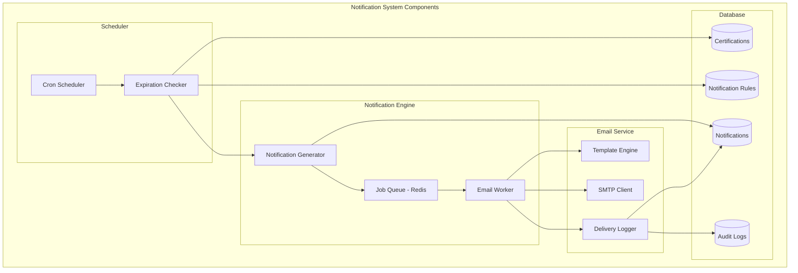
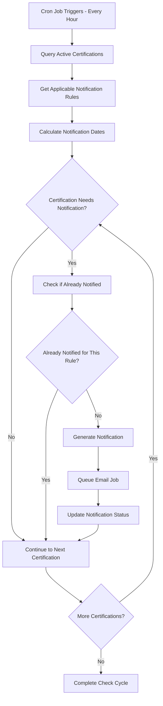
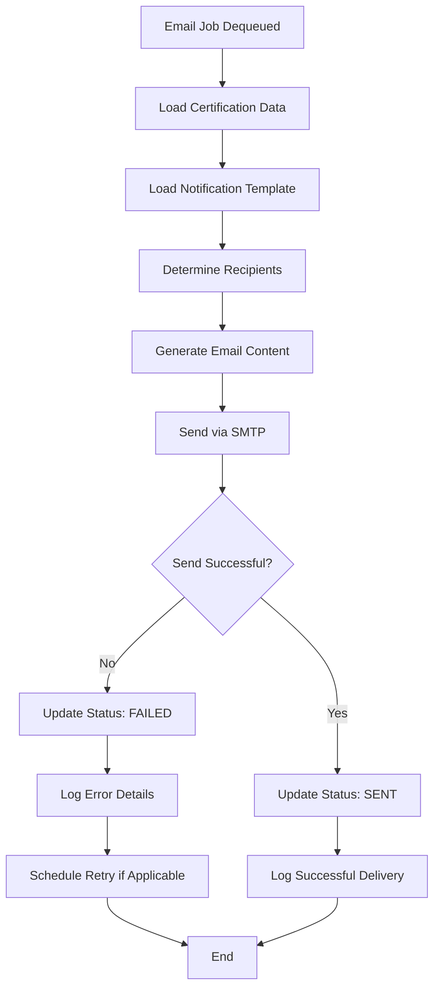

# CertiTrack - Arquitectura del Sistema de Notificaciones

## Visión General

El sistema de notificaciones de CertiTrack proporciona alertas por correo electrónico automatizadas para vencimientos de certificaciones con tiempos configurables (30, 15, 7, 1 día antes del vencimiento). El sistema utiliza un patrón de trabajador en segundo plano con cola de trabajos para una entrega confiable.

## Arquitectura del Sistema



## Sistema de Reglas de Notificación

### Configuración de Reglas

El sistema de notificaciones admite una configuración flexible de reglas en múltiples niveles:

1. **Reglas Globales**: Se aplican a todas las certificaciones
2. **Reglas por Categoría**: Se aplican a categorías específicas de certificaciones (seguridad, profesional, equipos)
3. **Reglas Específicas por Tipo**: Se aplican a tipos específicos de certificaciones

### Prioridad de las Reglas
Específicas por Tipo > Por Categoría > Globales

### Esquema de la Base de Datos (de database-schema.md)
```sql
CREATE TABLE notification_rules (
    id UUID PRIMARY KEY DEFAULT gen_random_uuid(),
    certification_type_id UUID REFERENCES certification_types(id), -- NULL para reglas globales
    category VARCHAR(50), -- NULL para reglas específicas por tipo
    days_before_expiration INTEGER NOT NULL,
    is_active BOOLEAN DEFAULT true,
    email_template VARCHAR(100) DEFAULT 'default_expiration', -- Plantilla de correo predeterminada
    recipient_roles TEXT[], -- JSON array of roles to notify
    created_at TIMESTAMP WITH TIME ZONE DEFAULT NOW(),
    updated_at TIMESTAMP WITH TIME ZONE DEFAULT NOW(),
    created_by UUID REFERENCES users(id) -- ID del usuario que creó la regla
);
```

### Reglas de Notificación Predeterminadas
```sql
-- Global rules (apply to all certifications)
INSERT INTO notification_rules (certification_type_id, category, days_before_expiration, is_active) VALUES
(NULL, NULL, 30, true),
(NULL, NULL, 15, true),
(NULL, NULL, 7, true),
(NULL, NULL, 1, true);

-- Category-specific rules (override global for safety certifications)
INSERT INTO notification_rules (certification_type_id, category, days_before_expiration, is_active) VALUES
(NULL, 'safety', 60, true),
(NULL, 'safety', 30, true),
(NULL, 'safety', 14, true),
(NULL, 'safety', 7, true),
(NULL, 'safety', 1, true);
```

## Flujo de Procesamiento de Notificaciones

### 1. Verificación Programada de Vencimientos



### 2. Flujo de Procesamiento de Correos Electrónicos



## Detalles de Implementación

### Implementación en el Backend con Go

#### Interfaz del Servicio de Notificaciones
```go
type NotificationService interface {
    CheckExpiringCertifications() error
    GenerateNotifications(certifications []models.Certification) error
    SendNotification(notification *models.Notification) error
    GetNotificationRules(certificationTypeID *uuid.UUID, category string) ([]models.NotificationRule, error)
    CreateNotificationRule(rule *models.NotificationRule) error
    UpdateNotificationRule(rule *models.NotificationRule) error
    DeleteNotificationRule(id uuid.UUID) error
}
```

#### Implementación del Verificador de Vencimientos
```go
type ExpirationChecker struct {
    db                  *gorm.DB
    notificationService NotificationService
    logger             *logrus.Logger
}

func (ec *ExpirationChecker) CheckExpiringCertifications() error {
    // Get all active certifications
    var certifications []models.Certification
    err := ec.db.Preload("CertificationType").
        Preload("Person").
        Preload("Equipment").
        Where("status = ? AND expiration_date > ?", "active", time.Now()).
        Find(&certifications).Error
    
    if err != nil {
        return fmt.Errorf("failed to fetch certifications: %w", err)
    }

    for _, cert := range certifications {
        if err := ec.processCertification(&cert); err != nil {
            ec.logger.WithError(err).
                WithField("certification_id", cert.ID).
                Error("Failed to process certification")
        }
    }

    return nil
}

func (ec *ExpirationChecker) processCertification(cert *models.Certification) error {
    // Get applicable notification rules
    rules, err := ec.notificationService.GetNotificationRules(
        &cert.CertificationTypeID, 
        cert.CertificationType.Category,
    )
    if err != nil {
        return err
    }

    daysUntilExpiration := int(time.Until(cert.ExpirationDate).Hours() / 24)

    for _, rule := range rules {
        if daysUntilExpiration == rule.DaysBeforeExpiration {
            // Check if notification already sent for this rule
            var existingNotification models.Notification
            err := ec.db.Where(
                "certification_id = ? AND notification_rule_id = ? AND status != ?",
                cert.ID, rule.ID, "failed",
            ).First(&existingNotification).Error

            if err == gorm.ErrRecordNotFound {
                // Create new notification
                notification := &models.Notification{
                    CertificationID:    cert.ID,
                    NotificationRuleID: &rule.ID,
                    RecipientEmail:     ec.determineRecipient(cert),
                    Subject:            ec.generateSubject(cert, rule),
                    Message:            ec.generateMessage(cert, rule),
                    Status:             "pending",
                    ScheduledFor:       time.Now(),
                }

                if err := ec.db.Create(notification).Error; err != nil {
                    return err
                }

                // Queue email job
                return ec.queueEmailJob(notification)
            }
        }
    }

    return nil
}
```

#### Implementación del Trabajador de Correos Electrónicos
```go
type EmailWorker struct {
    redis      *redis.Client
    smtpClient SMTPClient
    templates  *template.Template
    db         *gorm.DB
    logger     *logrus.Logger
}

func (ew *EmailWorker) Start() {
    for {
        // Block until job available
        result, err := ew.redis.BRPop(context.Background(), 0, "email_queue").Result()
        if err != nil {
            ew.logger.WithError(err).Error("Failed to dequeue email job")
            continue
        }

        var job EmailJob
        if err := json.Unmarshal([]byte(result[1]), &job); err != nil {
            ew.logger.WithError(err).Error("Failed to unmarshal email job")
            continue
        }

        if err := ew.processEmailJob(&job); err != nil {
            ew.logger.WithError(err).
                WithField("notification_id", job.NotificationID).
                Error("Failed to process email job")
        }
    }
}

func (ew *EmailWorker) processEmailJob(job *EmailJob) error {
    // Cargar notificación de la base de datos
    var notification models.Notification
    err := ew.db.Preload("Certification.CertificationType").
        Preload("Certification.Person").
        Preload("Certification.Equipment").
        First(&notification, job.NotificationID).Error
    
    if err != nil {
        return err
    }

    // Send email
    err = ew.smtpClient.SendEmail(SMTPMessage{
        To:      notification.RecipientEmail,
        Subject: notification.Subject,
        Body:    notification.Message,
        IsHTML:  true,
    })

    // Actualizar estado de la notificación
    if err != nil {
        notification.Status = "failed"
        notification.ErrorMessage = err.Error()
        
        // Programar reintento si está dentro de los límites de reintentos
        if notification.RetryCount < 3 {
            notification.RetryCount++
            notification.ScheduledFor = time.Now().Add(time.Duration(notification.RetryCount) * time.Hour)
            ew.queueRetry(&notification)
        }
    } else {
        notification.Status = "sent"
        notification.SentAt = &time.Time{}
        *notification.SentAt = time.Now()
    }

    return ew.db.Save(&notification).Error
}
```

### Plantillas de Correo Electrónico

#### Estructura de Plantillas
```go
type EmailTemplate struct {
    Name     string
    Subject  string
    HTMLBody string
    TextBody string
}

var templates = map[string]EmailTemplate{
    "expiration_warning": {
        Name:    "expiration_warning",
        Subject: "Certification Expiring Soon - {{.CertificationType.Name}}",
        HTMLBody: `
<!DOCTYPE html>
<html>
<head>
    <meta charset="UTF-8">
    <title>Certification Expiring Soon</title>
</head>
<body>
    <div style="font-family: Arial, sans-serif; max-width: 600px; margin: 0 auto;">
        <h2 style="color: #d97706;">Certification Expiring Soon</h2>
        
        <p>Dear {{if .Person}}{{.Person.FirstName}} {{.Person.LastName}}{{else}}Administrator{{end}},</p>
        
        <p>This is a reminder that the following certification will expire soon:</p>
        
        <div style="background-color: #f9fafb; padding: 20px; border-radius: 8px; margin: 20px 0;">
            <h3 style="margin-top: 0;">{{.CertificationType.Name}}</h3>
            <p><strong>Certificate Number:</strong> {{.CertificateNumber}}</p>
            <p><strong>Holder:</strong> 
                {{if .Person}}
                    {{.Person.FirstName}} {{.Person.LastName}} ({{.Person.EmployeeID}})
                {{else}}
                    {{.Equipment.Name}} ({{.Equipment.AssetNumber}})
                {{end}}
            </p>
            <p><strong>Expiration Date:</strong> {{.ExpirationDate.Format "January 2, 2006"}}</p>
            <p><strong>Days Until Expiration:</strong> {{.DaysUntilExpiration}}</p>
        </div>
        
        <p>Please take action to renew this certification before it expires.</p>
        
        <p>
            <a href="{{.SystemURL}}/certifications/{{.ID}}" 
               style="background-color: #2563eb; color: white; padding: 10px 20px; text-decoration: none; border-radius: 4px;">
                View Certification
            </a>
        </p>
        
        <hr style="margin: 30px 0; border: none; border-top: 1px solid #e5e7eb;">
        <p style="color: #6b7280; font-size: 12px;">
            This is an automated message from CertiTrack. Please do not reply to this email.
        </p>
    </div>
</body>
</html>
        `,
        TextBody: `
Certification Expiring Soon

Dear {{if .Person}}{{.Person.FirstName}} {{.Person.LastName}}{{else}}Administrator{{end}},

This is a reminder that the following certification will expire soon:

Certification: {{.CertificationType.Name}}
Certificate Number: {{.CertificateNumber}}
Holder: {{if .Person}}{{.Person.FirstName}} {{.Person.LastName}} ({{.Person.EmployeeID}}){{else}}{{.Equipment.Name}} ({{.Equipment.AssetNumber}}){{end}}
Expiration Date: {{.ExpirationDate.Format "January 2, 2006"}}
Days Until Expiration: {{.DaysUntilExpiration}}

Please take action to renew this certification before it expires.

View certification: {{.SystemURL}}/certifications/{{.ID}}

---
This is an automated message from CertiTrack. Please do not reply to this email.
        `,
    },
}
```

### Configuración SMTP

#### Interfaz del Cliente SMTP
```go
type SMTPClient interface {
    SendEmail(message SMTPMessage) error
    TestConnection() error
}

type SMTPMessage struct {
    To      string
    Subject string
    Body    string
    IsHTML  bool
}

type SMTPConfig struct {
    Host     string
    Port     int
    Username string
    Password string
    From     string
    UseTLS   bool
}

func NewSMTPClient(config SMTPConfig) SMTPClient {
    return &smtpClient{
        config: config,
        auth:   smtp.PlainAuth("", config.Username, config.Password, config.Host),
    }
}
```

#### Implementación SMTP
```go
func (sc *smtpClient) SendEmail(message SMTPMessage) error {
    // Crear mensaje
    msg := fmt.Sprintf("To: %s\r\n", message.To)
    msg += fmt.Sprintf("From: %s\r\n", sc.config.From)
    msg += fmt.Sprintf("Subject: %s\r\n", message.Subject)
    
    if message.IsHTML {
        msg += "MIME-Version: 1.0\r\n"
        msg += "Content-Type: text/html; charset=UTF-8\r\n"
    }
    
    msg += "\r\n" + message.Body

    // Send email
    addr := fmt.Sprintf("%s:%d", sc.config.Host, sc.config.Port)
    
    if sc.config.UseTLS {
        return sc.sendWithTLS(addr, []string{message.To}, []byte(msg))
    }
    
    return smtp.SendMail(addr, sc.auth, sc.config.From, []string{message.To}, []byte(msg))
}
```

## Determinación de Destinatarios

### Lógica de Destinatarios
```go
func (ec *ExpirationChecker) determineRecipient(cert *models.Certification) string {
    // Orden de prioridad:
    // 1. Person's email (if certification belongs to person)
    // 2. Equipment manager/department email
    // 3. System administrator email
    
    if cert.Person != nil && cert.Person.Email != "" {
        return cert.Person.Email
    }
    
    if cert.Equipment != nil {
        // Look up equipment manager or department contact
        // For MVP, use system admin email
        return ec.getSystemAdminEmail()
    }
    
    return ec.getSystemAdminEmail()
}

func (ec *ExpirationChecker) getSystemAdminEmail() string {
    var admin models.User
    ec.db.Where("role = ?", "admin").First(&admin)
    return admin.Email
}
```

## Gestión de Configuración

### Variables de Entorno
```env
# SMTP Configuration
SMTP_HOST=smtp.gmail.com
SMTP_PORT=587
SMTP_USERNAME=notifications@company.com
SMTP_PASSWORD=app-specific-password
SMTP_FROM=CertiTrack <notifications@company.com>
SMTP_USE_TLS=true

# Configuración de Notificaciones
NOTIFICATION_CHECK_INTERVAL=1h
EMAIL_QUEUE_NAME=email_queue
MAX_RETRY_ATTEMPTS=3
RETRY_DELAY_HOURS=1,2,4

# URLs del Sistema
SYSTEM_BASE_URL=https://certitrack.company.com
```

### API de Configuración de Notificaciones
```go
// Admin endpoints for managing notification rules
router.GET("/admin/notification-rules", getNotificationRules)
router.POST("/admin/notification-rules", createNotificationRule)
router.PUT("/admin/notification-rules/:id", updateNotificationRule)
router.DELETE("/admin/notification-rules/:id", deleteNotificationRule)
router.POST("/admin/test-notification", sendTestNotification)
```

## Monitoreo y Registro

### Métricas de Notificaciones
- Total notifications sent per day/week/month
- Delivery success rate
- Failed notification reasons
- Average processing time
- Queue depth monitoring

### Estrategia de Registro
```go
type NotificationLogger struct {
    logger *logrus.Logger
}

func (nl *NotificationLogger) LogNotificationSent(notification *models.Notification) {
    nl.logger.WithFields(logrus.Fields{
        "notification_id":    notification.ID,
        "certification_id":   notification.CertificationID,
        "recipient":         notification.RecipientEmail,
        "days_before_expiry": notification.NotificationRule.DaysBeforeExpiration,
        "delivery_time":     time.Since(notification.ScheduledFor),
    }).Info("Notification sent successfully")
}

func (nl *NotificationLogger) LogNotificationFailed(notification *models.Notification, err error) {
    nl.logger.WithFields(logrus.Fields{
        "notification_id":  notification.ID,
        "certification_id": notification.CertificationID,
        "recipient":       notification.RecipientEmail,
        "error":          err.Error(),
        "retry_count":    notification.RetryCount,
    }).Error("Notification delivery failed")
}
```

## Estrategia de Pruebas

### Pruebas Unitarias
- Renderizado de plantillas con varios escenarios de datos
- Lógica de determinación de destinatarios
- Evaluación de reglas de notificación
- Simulación del cliente SMTP

### Pruebas de Integración
- Flujo de notificaciones de extremo a extremo
- Pruebas de interacción con la base de datos
- Operaciones de cola de Redis
- Verificación de entrega de correos electrónicos

### Pruebas de Carga
- Procesamiento de alto volumen de notificaciones
- Rendimiento de la cola bajo carga
- Cumplimiento de límites de tasa SMTP

Este sistema de notificaciones proporciona alertas de correo electrónico confiables, configurables y escalables para vencimientos de certificaciones, manteniendo registros de auditoría y permitiendo futuras mejoras como notificaciones por SMS o dentro de la aplicación.