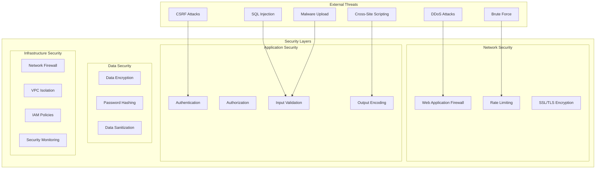

# CertiTrack - Consideraciones y Mejores Prácticas de Seguridad

## Visión General

Este documento describe las medidas de seguridad integrales, el análisis de amenazas y las mejores prácticas para el sistema de gestión de certificaciones CertiTrack. La seguridad es primordial dada la naturaleza sensible de los datos de certificación y los requisitos de cumplimiento.

## Arquitectura de Seguridad



## Análisis del Modelo de Amenazas

### Análisis de Amenazas STRIDE

#### Suplantación
**Amenazas:**
- Suplantación de usuarios legítimos
- Secuestro de sesión
- Robo de tokens

**Mitigaciones:**
- Autenticación fuerte (JWT con caducidad corta)
- Autenticación de múltiples factores (mejora futura)
- Gestión segura de sesiones
- Aplicación de HTTPS

#### Manipulación
**Amenazas:**
- Modificación de datos en tránsito
- Manipulación de la base de datos
- Corrupción de archivos

**Mitigaciones:**
- Cifrado TLS para todas las comunicaciones
- Controles de acceso a la base de datos
- Verificaciones de integridad de archivos
- Registro de auditoría

#### Repudio
**Amenazas:**
- Usuarios que niegan acciones
- Falta de responsabilidad

**Mitigaciones:**
- Registro de auditoría completo
- Firmas digitales (mejora futura)
- Almacenamiento inmutable de registros
- Seguimiento de acciones del usuario

#### Divulgación de Información
**Amenazas:**
- Acceso no autorizado a datos
- Fuga de información
- Exposición de información sensible

**Mitigaciones:**
- Control de acceso basado en roles
- Cifrado de datos en reposo
- Diseño seguro de API
- Clasificación de la información

#### Denegación de Servicio
**Amenazas:**
- Indisponibilidad del servicio
- Agotamiento de recursos
- Sobrecarga del sistema

**Mitigaciones:**
- Limitación de tasa
- Monitoreo de recursos
- Balanceo de carga
- Protección contra DDoS

#### Elevación de Privilegios
**Amenazas:**
- Escalada de privilegios
- Acceso de administrador no autorizado
- Manipulación de roles

**Mitigaciones:**
- Principio de menor privilegio
- Validación de roles
- Verificación de permisos
- Revisiones regulares de acceso

## Seguridad de Autenticación

### Seguridad de Tokens JWT

```go
// Secure JWT implementation
type JWTConfig struct {
    SecretKey          []byte
    AccessTokenExpiry  time.Duration
    RefreshTokenExpiry time.Duration
    Issuer            string
    Audience          string
}

func (j *JWTService) GenerateTokenPair(user *models.User) (*TokenPair, error) {
    // Generate cryptographically secure random bytes for JTI
    jti := make([]byte, 16)
    if _, err := rand.Read(jti); err != nil {
        return nil, fmt.Errorf("failed to generate JTI: %w", err)
    }

    now := time.Now()
    
    // Access token claims
    accessClaims := &Claims{
        UserID:    user.ID,
        Email:     user.Email,
        Role:      user.Role,
        FirstName: user.FirstName,
        LastName:  user.LastName,
        RegisteredClaims: jwt.RegisteredClaims{
            ID:        hex.EncodeToString(jti),
            Subject:   user.ID.String(),
            Issuer:    j.config.Issuer,
            Audience:  []string{j.config.Audience},
            IssuedAt:  jwt.NewNumericDate(now),
            NotBefore: jwt.NewNumericDate(now),
            ExpiresAt: jwt.NewNumericDate(now.Add(j.config.AccessTokenExpiry)),
        },
    }

    // Sign with HMAC-SHA256
    accessToken := jwt.NewWithClaims(jwt.SigningMethodHS256, accessClaims)
    accessTokenString, err := accessToken.SignedString(j.config.SecretKey)
    if err != nil {
        return nil, fmt.Errorf("failed to sign access token: %w", err)
    }

    // Generate refresh token
    refreshToken, err := j.generateRefreshToken(user.ID, hex.EncodeToString(jti))
    if err != nil {
        return nil, fmt.Errorf("failed to generate refresh token: %w", err)
    }

    return &TokenPair{
        AccessToken:  accessTokenString,
        RefreshToken: refreshToken,
        ExpiresAt:    now.Add(j.config.AccessTokenExpiry),
    }, nil
}

func (j *JWTService) ValidateAccessToken(tokenString string) (*Claims, error) {
    token, err := jwt.ParseWithClaims(tokenString, &Claims{}, func(token *jwt.Token) (interface{}, error) {
        // Validate signing method
        if _, ok := token.Method.(*jwt.SigningMethodHMAC); !ok {
            return nil, fmt.Errorf("unexpected signing method: %v", token.Header["alg"])
        }
        return j.config.SecretKey, nil
    })

    if err != nil {
        return nil, fmt.Errorf("failed to parse token: %w", err)
    }

    claims, ok := token.Claims.(*Claims)
    if !ok || !token.Valid {
        return nil, fmt.Errorf("invalid token claims")
    }

    // Additional validation
    if claims.Issuer != j.config.Issuer {
        return nil, fmt.Errorf("invalid issuer")
    }

    if !claims.VerifyAudience(j.config.Audience, true) {
        return nil, fmt.Errorf("invalid audience")
    }

    return claims, nil
}
```

### Seguridad de Contraseñas

```go
type PasswordService struct {
    minLength      int
    requireUpper   bool
    requireLower   bool
    requireNumber  bool
    requireSpecial bool
    bcryptCost     int
}

func NewPasswordService() *PasswordService {
    return &PasswordService{
        minLength:      8,
        requireUpper:   true,
        requireLower:   true,
        requireNumber:  true,
        requireSpecial: true,
        bcryptCost:     12, // High cost for security
    }
}

func (ps *PasswordService) ValidatePasswordStrength(password string) error {
    if len(password) < ps.minLength {
        return fmt.Errorf("password must be at least %d characters long", ps.minLength)
    }

    var hasUpper, hasLower, hasNumber, hasSpecial bool
    
    for _, char := range password {
        switch {
        case unicode.IsUpper(char):
            hasUpper = true
        case unicode.IsLower(char):
            hasLower = true
        case unicode.IsNumber(char):
            hasNumber = true
        case unicode.IsPunct(char) || unicode.IsSymbol(char):
            hasSpecial = true
        }
    }

    if ps.requireUpper && !hasUpper {
        return fmt.Errorf("password must contain at least one uppercase letter")
    }
    if ps.requireLower && !hasLower {
        return fmt.Errorf("password must contain at least one lowercase letter")
    }
    if ps.requireNumber && !hasNumber {
        return fmt.Errorf("password must contain at least one number")
    }
    if ps.requireSpecial && !hasSpecial {
        return fmt.Errorf("password must contain at least one special character")
    }

    return nil
}

func (ps *PasswordService) HashPassword(password string) (string, error) {
    // Validate password strength first
    if err := ps.ValidatePasswordStrength(password); err != nil {
        return "", err
    }

    bytes, err := bcrypt.GenerateFromPassword([]byte(password), ps.bcryptCost)
    if err != nil {
        return "", fmt.Errorf("failed to hash password: %w", err)
    }
    
    return string(bytes), nil
}

func (ps *PasswordService) VerifyPassword(hashedPassword, password string) bool {
    err := bcrypt.CompareHashAndPassword([]byte(hashedPassword), []byte(password))
    return err == nil
}
```

## Validación y Saneamiento de Entrada

### Validación de Entrada en el Backend

```go
// Validation middleware
func ValidationMiddleware() gin.HandlerFunc {
    return gin.HandlerFunc(func(c *gin.Context) {
        // Validate Content-Type for POST/PUT requests
        if c.Request.Method == "POST" || c.Request.Method == "PUT" {
            contentType := c.GetHeader("Content-Type")
            if !strings.Contains(contentType, "application/json") && 
               !strings.Contains(contentType, "multipart/form-data") {
                c.JSON(400, gin.H{"error": "Invalid Content-Type"})
                c.Abort()
                return
            }
        }

        // Validate request size
        if c.Request.ContentLength > 10*1024*1024 { // 10MB limit
            c.JSON(413, gin.H{"error": "Request too large"})
            c.Abort()
            return
        }

        c.Next()
    })
}

// Input sanitization
type Sanitizer struct {
    htmlPolicy *bluemonday.Policy
}

func NewSanitizer() *Sanitizer {
    policy := bluemonday.StrictPolicy()
    return &Sanitizer{htmlPolicy: policy}
}

func (s *Sanitizer) SanitizeString(input string) string {
    // Remove HTML tags
    sanitized := s.htmlPolicy.Sanitize(input)
    
    // Trim whitespace
    sanitized = strings.TrimSpace(sanitized)
    
    // Remove null bytes
    sanitized = strings.ReplaceAll(sanitized, "\x00", "")
    
    return sanitized
}

func (s *Sanitizer) ValidateEmail(email string) error {
    emailRegex := regexp.MustCompile(`^[a-zA-Z0-9._%+-]+@[a-zA-Z0-9.-]+\.[a-zA-Z]{2,}$`)
    if !emailRegex.MatchString(email) {
        return fmt.Errorf("invalid email format")
    }
    
    if len(email) > 254 {
        return fmt.Errorf("email too long")
    }
    
    return nil
}

// SQL injection prevention with GORM
func (r *userRepository) GetByEmail(ctx context.Context, email string) (*models.User, error) {
    var user models.User
    
    // GORM automatically handles parameterized queries
    err := r.db.WithContext(ctx).Where("email = ?", email).First(&user).Error
    if err != nil {
        if errors.Is(err, gorm.ErrRecordNotFound) {
            return nil, ErrUserNotFound
        }
        return nil, fmt.Errorf("failed to get user: %w", err)
    }
    
    return &user, nil
}
```

### Validación de Entrada en el Frontend

```typescript
// Input validation utilities
export const ValidationRules = {
  email: {
    required: 'Email is required',
    pattern: {
      value: /^[A-Z0-9._%+-]+@[A-Z0-9.-]+\.[A-Z]{2,}$/i,
      message: 'Invalid email address'
    },
    maxLength: {
      value: 254,
      message: 'Email must be less than 254 characters'
    }
  },
  
  password: {
    required: 'Password is required',
    minLength: {
      value: 8,
      message: 'Password must be at least 8 characters'
    },
    pattern: {
      value: /^(?=.*[a-z])(?=.*[A-Z])(?=.*\d)(?=.*[@$!%*?&])[A-Za-z\d@$!%*?&]/,
      message: 'Password must contain uppercase, lowercase, number, and special character'
    }
  },
  
  certificateNumber: {
    required: 'Certificate number is required',
    pattern: {
      value: /^[A-Z0-9-]+$/,
      message: 'Certificate number can only contain letters, numbers, and hyphens'
    },
    maxLength: {
      value: 50,
      message: 'Certificate number must be less than 50 characters'
    }
  }
};

// XSS prevention
export const sanitizeInput = (input: string): string => {
  return input
    .replace(/[<>]/g, '') // Remove angle brackets
    .replace(/javascript:/gi, '') // Remove javascript: protocol
    .replace(/on\w+=/gi, '') // Remove event handlers
    .trim();
};

// CSRF protection
export const getCSRFToken = (): string => {
  const meta = document.querySelector('meta[name="csrf-token"]');
  return meta ? meta.getAttribute('content') || '' : '';
};

// Secure API client
class SecureApiClient {
  private baseURL: string;
  private csrfToken: string;

  constructor(baseURL: string) {
    this.baseURL = baseURL;
    this.csrfToken = getCSRFToken();
  }

  private getHeaders(): Record<string, string> {
    const headers: Record<string, string> = {
      'Content-Type': 'application/json',
    };

    const token = localStorage.getItem('accessToken');
    if (token) {
      headers.Authorization = `Bearer ${token}`;
    }

    if (this.csrfToken) {
      headers['X-CSRF-Token'] = this.csrfToken;
    }

    return headers;
  }

  async post<T>(endpoint: string, data: any): Promise<T> {
    const response = await fetch(`${this.baseURL}${endpoint}`, {
      method: 'POST',
      headers: this.getHeaders(),
      body: JSON.stringify(data),
      credentials: 'same-origin', // Include cookies for CSRF
    });

    if (!response.ok) {
      throw new Error(`HTTP error! status: ${response.status}`);
    }

    return response.json();
  }
}
```

## Seguridad en la Carga de Archivos

### Implementación Segura de Carga de Archivos

```go
type FileValidator struct {
    maxSize        int64
    allowedTypes   map[string]bool
    allowedExts    map[string]bool
    virusScanner   VirusScanner
}

func NewFileValidator() *FileValidator {
    return &FileValidator{
        maxSize: 10 * 1024 * 1024, // 10MB
        allowedTypes: map[string]bool{
            "application/pdf":  true,
            "image/jpeg":       true,
            "image/png":        true,
            "image/gif":        true,
            "application/msword": true,
            "application/vnd.openxmlformats-officedocument.wordprocessingml.document": true,
        },
        allowedExts: map[string]bool{
            ".pdf":  true,
            ".jpg":  true,
            ".jpeg": true,
            ".png":  true,
            ".gif":  true,
            ".doc":  true,
            ".docx": true,
        },
    }
}

func (fv *FileValidator) ValidateFile(fileHeader *multipart.FileHeader) error {
    // Check file size
    if fileHeader.Size > fv.maxSize {
        return fmt.Errorf("file size exceeds maximum allowed size of %d bytes", fv.maxSize)
    }

    // Check file extension
    ext := strings.ToLower(filepath.Ext(fileHeader.Filename))
    if !fv.allowedExts[ext] {
        return fmt.Errorf("file extension %s not allowed", ext)
    }

    // Open file to check content
    file, err := fileHeader.Open()
    if err != nil {
        return fmt.Errorf("failed to open file: %w", err)
    }
    defer file.Close()

    // Read first 512 bytes to detect MIME type
    buffer := make([]byte, 512)
    n, err := file.Read(buffer)
    if err != nil && err != io.EOF {
        return fmt.Errorf("failed to read file: %w", err)
    }

    // Detect MIME type
    mimeType := http.DetectContentType(buffer[:n])
    if !fv.allowedTypes[mimeType] {
        return fmt.Errorf("file type %s not allowed", mimeType)
    }

    // Reset file pointer
    file.Seek(0, 0)

    // Read entire file for virus scanning
    content, err := io.ReadAll(file)
    if err != nil {
        return fmt.Errorf("failed to read file content: %w", err)
    }

    // Virus scan
    if fv.virusScanner != nil {
        if err := fv.virusScanner.ScanBytes(content); err != nil {
            return fmt.Errorf("file failed security scan: %w", err)
        }
    }

    // Additional security checks
    if err := fv.checkFileContent(content, mimeType); err != nil {
        return fmt.Errorf("file content validation failed: %w", err)
    }

    return nil
}

func (fv *FileValidator) checkFileContent(content []byte, mimeType string) error {
    // Check for embedded scripts in PDFs
    if mimeType == "application/pdf" {
        if bytes.Contains(content, []byte("/JavaScript")) ||
           bytes.Contains(content, []byte("/JS")) ||
           bytes.Contains(content, []byte("/OpenAction")) {
            return fmt.Errorf("PDF contains potentially malicious content")
        }
    }

    // Check for suspicious patterns
    suspiciousPatterns := [][]byte{
        []byte("<?php"),
        []byte("<script"),
        []byte("javascript:"),
        []byte("vbscript:"),
    }

    for _, pattern := range suspiciousPatterns {
        if bytes.Contains(bytes.ToLower(content), pattern) {
            return fmt.Errorf("file contains suspicious content")
        }
    }

    return nil
}

// Secure file storage
func (fs *fileService) saveFileSecurely(filePath string, content []byte) error {
    // Create directory with secure permissions
    dir := filepath.Dir(filePath)
    if err := os.MkdirAll(dir, 0755); err != nil {
        return fmt.Errorf("failed to create directory: %w", err)
    }

    // Write file with restricted permissions
    if err := os.WriteFile(filePath, content, 0644); err != nil {
        return fmt.Errorf("failed to write file: %w", err)
    }

    // Set file attributes to prevent execution
    if err := fs.setSecureFileAttributes(filePath); err != nil {
        return fmt.Errorf("failed to set secure attributes: %w", err)
    }

    return nil
}
```

## Seguridad de la Base de Datos

### Seguridad de la Conexión

```go
// Secure database configuration
type DatabaseConfig struct {
    Host            string
    Port            int
    Database        string
    Username        string
    Password        string
    SSLMode         string
    MaxOpenConns    int
    MaxIdleConns    int
    ConnMaxLifetime time.Duration
    ConnMaxIdleTime time.Duration
}

func NewSecureDatabase(config DatabaseConfig) (*gorm.DB, error) {
    // Build connection string with SSL
    dsn := fmt.Sprintf(
        "host=%s port=%d user=%s password=%s dbname=%s sslmode=%s",
        config.Host, config.Port, config.Username, config.Password,
        config.Database, config.SSLMode,
    )

    db, err := gorm.Open(postgres.Open(dsn), &gorm.Config{
        Logger: logger.Default.LogMode(logger.Silent), // Disable SQL logging in production
        NamingStrategy: schema.NamingStrategy{
            TablePrefix:   "ct_", // Table prefix for namespace isolation
            SingularTable: false,
        },
    })
    if err != nil {
        return nil, fmt.Errorf("failed to connect to database: %w", err)
    }

    sqlDB, err := db.DB()
    if err != nil {
        return nil, fmt.Errorf("failed to get underlying sql.DB: %w", err)
    }

    // Configure connection pool
    sqlDB.SetMaxOpenConns(config.MaxOpenConns)
    sqlDB.SetMaxIdleConns(config.MaxIdleConns)
    sqlDB.SetConnMaxLifetime(config.ConnMaxLifetime)
    sqlDB.SetConnMaxIdleTime(config.ConnMaxIdleTime)

    return db, nil
}

// Row-level security (future enhancement)
func (r *certificationRepository) GetCertificationsByUser(ctx context.Context, userID uuid.UUID, role string) ([]*models.Certification, error) {
    var certifications []*models.Certification
    
    query := r.db.WithContext(ctx).Preload("CertificationType").Preload("Person").Preload("Equipment")
    
    // Apply row-level security based on user role
    if role != "admin" {
        // Regular users can only see certifications they created or are assigned to
        query = query.Where("created_by = ? OR person_id IN (SELECT id FROM people WHERE created_by = ?)", userID, userID)
    }
    
    err := query.Find(&certifications).Error
    if err != nil {
        return nil, fmt.Errorf("failed to get certifications: %w", err)
    }
    
    return certifications, nil
}
```

## Seguridad de Red

### Configuración HTTPS

```nginx
# Secure Nginx configuration
server {
    listen 443 ssl http2;
    server_name certitrack.company.com;

    # SSL Configuration
    ssl_certificate /etc/nginx/ssl/cert.pem;
    ssl_certificate_key /etc/nginx/ssl/key.pem;
    
    # Modern SSL configuration
    ssl_protocols TLSv1.2 TLSv1.3;
    ssl_ciphers ECDHE-ECDSA-AES128-GCM-SHA256:ECDHE-RSA-AES128-GCM-SHA256:ECDHE-ECDSA-AES256-GCM-SHA384:ECDHE-RSA-AES256-GCM-SHA384;
    ssl_prefer_server_ciphers off;
    
    # SSL session configuration
    ssl_session_cache shared:SSL:10m;
    ssl_session_timeout 10m;
    ssl_session_tickets off;
    
    # OCSP stapling
    ssl_stapling on;
    ssl_stapling_verify on;
    
    # Security headers
    add_header Strict-Transport-Security "max-age=63072000; includeSubDomains; preload" always;
    add_header X-Frame-Options DENY always;
    add_header X-Content-Type-Options nosniff always;
    add_header X-XSS-Protection "1; mode=block" always;
    add_header Referrer-Policy "strict-origin-when-cross-origin" always;
    add_header Content-Security-Policy "default-src 'self'; script-src 'self' 'unsafe-inline'; style-src 'self' 'unsafe-inline'; img-src 'self' data:; font-src 'self'; connect-src 'self'; frame-ancestors 'none';" always;
    
    # Rate limiting
    limit_req_zone $binary_remote_addr zone=general:10m rate=10r/s;
    limit_req_zone $binary_remote_addr zone=auth:10m rate=5r/m;
    
    location / {
        limit_req zone=general burst=20 nodelay;
        proxy_pass http://frontend;
        proxy_set_header Host $host;
        proxy_set_header X-Real-IP $remote_addr;
        proxy_set_header X-Forwarded-For $proxy_add_x_forwarded_for;
        proxy_set_header X-Forwarded-Proto $scheme;
    }
    
    location /api/v1/auth/ {
        limit_req zone=auth burst=5 nodelay;
        proxy_pass http://backend;
        proxy_set_header Host $host;
        proxy_set_header X-Real-IP $remote_addr;
        proxy_set_header X-Forwarded-For $proxy_add_x_forwarded_for;
        proxy_set_header X-Forwarded-Proto $scheme;
    }
}
```

## Monitoreo y Respuesta a Incidentes

### Monitoreo de Seguridad

```go
// Security event logging
type SecurityEvent struct {
    ID          uuid.UUID `gorm:"type:uuid;primary_key;default:gen_random_uuid()"`
    EventType   string    `gorm:"not null"` // LOGIN_FAILED, SUSPICIOUS_ACTIVITY, etc.
    UserID      *uuid.UUID
    IPAddress   string
    UserAgent   string
    Details     string
    Severity    string    // LOW, MEDIUM, HIGH, CRITICAL
    CreatedAt   time.Time
}

type SecurityMonitor struct {
    db     *gorm.DB
    logger *logrus.Logger
    alerts AlertService
}

func (sm *SecurityMonitor) LogSecurityEvent(eventType string, userID *uuid.UUID, ipAddress, userAgent, details, severity string) {
    event := SecurityEvent{
        EventType: eventType,
        UserID:    userID,
        IPAddress: ipAddress,
        UserAgent: userAgent,
        Details:   details,
        Severity:  severity,
        CreatedAt: time.Now(),
    }

    if err := sm.db.Create(&event).Error; err != nil {
        sm.logger.WithError(err).Error("Failed to log security event")
    }

    // Send alert for high severity events
    if severity == "HIGH" || severity == "CRITICAL" {
        sm.alerts.SendSecurityAlert(event)
    }

    // Log to structured logger
    sm.logger.WithFields(logrus.Fields{
        "event_type": eventType,
        "user_id":    userID,
        "ip_address": ipAddress,
        "severity":   severity,
        "details":    details,
    }).Warn("Security event detected")
}

// Brute force protection
type BruteForceProtection struct {
    redis  *redis.Client
    logger *logrus.Logger
}

func (bfp *BruteForceProtection) CheckLoginAttempts(ipAddress string) error {
    key := fmt.Sprintf("login_attempts:%s", ipAddress)
    
    attempts, err := bfp.redis.Get(context.Background(), key).Int()
    if err != nil && err != redis.Nil {
        return fmt.Errorf("failed to get login attempts: %w", err)
    }

    if attempts >= 5 {
        return fmt.Errorf("too many login attempts, please try again later")
    }

    return nil
}

func (bfp *BruteForceProtection) RecordFailedLogin(ipAddress string) {
    key := fmt.Sprintf("login_attempts:%s", ipAddress)
    
    pipe := bfp.redis.Pipeline()
    pipe.Incr(context.Background(), key)
    pipe.Expire(context.Background(), key, 15*time.Minute)
    
    if _, err := pipe.Exec(context.Background()); err != nil {
        bfp.logger.WithError(err).Error("Failed to record failed login attempt")
    }
}
```

## Cumplimiento y Auditoría

### Implementación de Pista de Auditoría

```go
// Comprehensive audit logging
type AuditLog struct {
    ID          uuid.UUID `gorm:"type:uuid;primary_key;default:gen_random_uuid()"`
    TableName   string    `gorm:"not null"`
    RecordID    uuid.UUID `gorm:"type:uuid;not null"`
    Action      string    `gorm:"not null"` // CREATE, UPDATE, DELETE, VIEW
    OldValues   datatypes.JSON
    NewValues   datatypes.JSON
    UserID      *uuid.UUID
    IPAddress   string
    UserAgent   string
    Timestamp   time.Time `gorm:"not null"`
}

func (al *AuditLogger) LogAction(tableName string, recordID uuid.UUID, action string, oldValues, newValues interface{}, userID *uuid.UUID, ipAddress, userAgent string) {
    oldJSON, _ := json.Marshal(oldValues)
    newJSON, _ := json.Marshal(newValues)

    auditLog := AuditLog{
        TableName: tableName,
        RecordID:  recordID,
        Action:    action,
        OldValues: oldJSON,
        NewValues: newJSON,
        UserID:    userID,
        IPAddress: ipAddress,
        UserAgent: userAgent,
        Timestamp: time.Now(),
    }

    if err := al.db.Create(&auditLog).Error; err != nil {
        al.logger.WithError(err).Error("Failed to create audit log")
    }
}

// GORM hooks for automatic auditing
func (c *Certification) BeforeUpdate(tx *gorm.DB) error {
    // Get original values
    var original Certification
    if err := tx.First(&original, c.ID).Error; err != nil {
        return err
    }

    // Log the change
    auditLogger := GetAuditLogger(tx)
    auditLogger.LogAction("certifications", c.ID, "UPDATE", original, c, GetCurrentUserID(tx), GetClientIP(tx), GetUserAgent(tx))

    return nil
}
```

## Configuración de Seguridad

### Seguridad del Entorno

```env
# Production security configuration
# JWT Configuration
JWT_SECRET=your-super-secure-jwt-secret-key-minimum-32-characters-long
JWT_ACCESS_TOKEN_EXPIRY=15m
JWT_REFRESH_TOKEN_EXPIRY=168h

# Database Security
DB_SSL_MODE=require
DB_MAX_OPEN_CONNS=25
DB_MAX_IDLE_CONNS=5
DB_CONN_MAX_LIFETIME=1h

# Rate Limiting
RATE_LIMIT_ENABLED=true
RATE_LIMIT_REQUESTS_PER_MINUTE=60
AUTH_RATE_LIMIT_REQUESTS_PER_MINUTE=5

# File Upload Security
MAX_FILE_SIZE_MB=10
VIRUS_SCANNING_ENABLED=true
FILE_ENCRYPTION_ENABLED=false

# Security Headers
ENABLE_SECURITY_HEADERS=true
ENABLE_CSRF_PROTECTION=true
ENABLE_CORS_PROTECTION=true

# Monitoring
SECURITY_MONITORING_ENABLED=true
FAILED_LOGIN_THRESHOLD=5
FAILED_LOGIN_LOCKOUT_DURATION=15m

# Backup Security
BACKUP_ENCRYPTION_ENABLED=true
BACKUP_RETENTION_DAYS=90
```

## Lista de Verificación de Seguridad

### Lista de Verificación de Seguridad Pre-Despliegue

- [ ] Todos los secretos almacenados en variables de entorno
- [ ] HTTPS habilitado con configuración SSL robusta
- [ ] Autenticación de múltiples factores (MFA) implementada
- [ ] Control de acceso basado en roles (RBAC) configurado
- [ ] Política de contraseñas seguras aplicada
- [ ] Registro de auditoría habilitado para todas las operaciones críticas
- [ ] Copias de seguridad automatizadas y cifradas configuradas
- [ ] Escaneo de vulnerabilidades realizado y corregido
- [ ] Configuración de CORS correctamente establecida
- [ ] Headers de seguridad HTTP configurados (CSP, XSS Protection, etc.)
- [ ] Protección contra ataques CSRF implementada
- [ ] Límites de tasa (rate limiting) configurados para las API
- [ ] Validación de entrada implementada en todos los formularios y endpoints
- [ ] Política de seguridad de contenido (CSP) configurada
- [ ] Certificados SSL/TLS actualizados y configurados correctamente
- [ ] Configuración de seguridad del servidor web revisada y endurecida
- [ ] Monitoreo de seguridad implementado