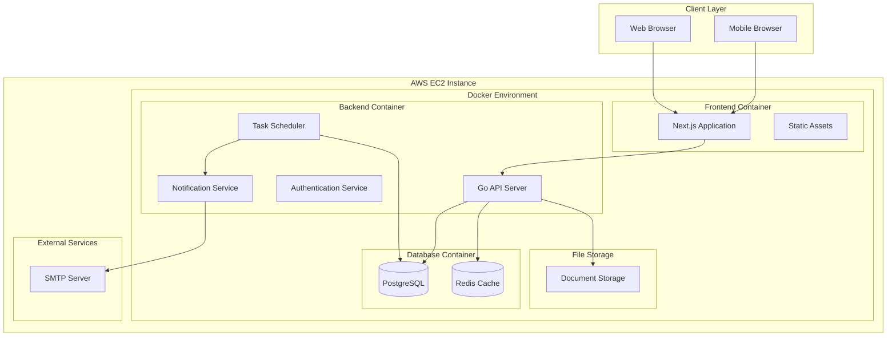
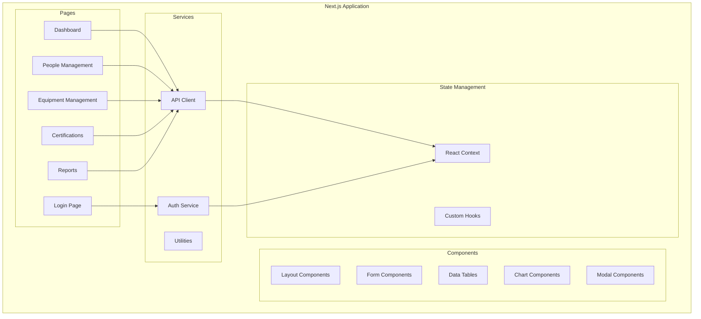
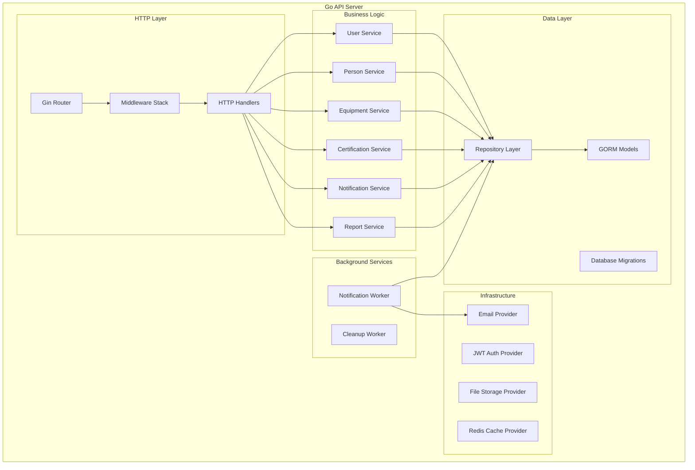
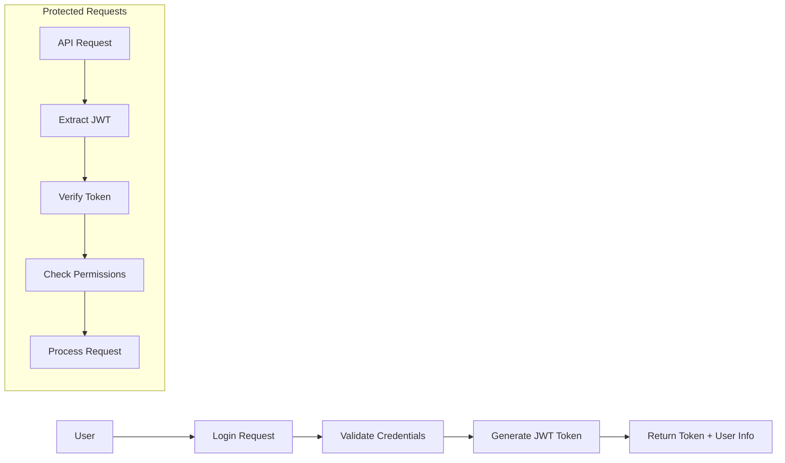
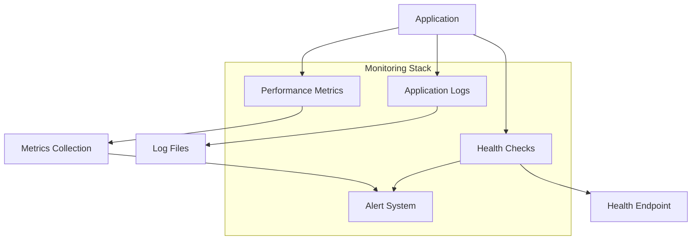

# CertiTrack - Diseño de la Arquitectura del Sistema

## Visión General de la Arquitectura de Alto Nivel

CertiTrack sigue un patrón de arquitectura de tres capas optimizado para implementación en una única instancia de AWS EC2 utilizando contenedores Docker.



## Arquitectura de Componentes

### Capa de Frontend (Next.js)



### Capa de Backend (Go con Gin)



## Especificaciones Detalladas de los Componentes

### 1. Componentes de Frontend (Next.js/React)

#### Páginas Principales
- **Página de Inicio de Sesión**: Interfaz de autenticación con validación de formulario
- **Panel de Control**: Visión general del estado de certificaciones, alertas y acciones rápidas
- **Gestión de Personas**: Operaciones CRUD para registros de personal
- **Gestión de Equipos**: Operaciones CRUD para registros de equipos
- **Certificaciones**: Gestión de certificaciones con filtrado y búsqueda
- **Informes**: Visualización de datos y funcionalidad de exportación

#### Componentes Reutilizables
- **Tabla de Datos**: Tabla ordenable, filtrable con paginación
- **Constructor de Formularios**: Generación dinámica de formularios con validación
- **Selector de Fechas**: Selección de fechas con validación
- **Cargador de Archivos**: Componente de arrastrar y soltar para subir archivos
- **Banner de Notificaciones**: Alertas y mensajes del sistema
- **Diálogo de Confirmación**: Ventanas modales de confirmación para acciones destructivas

#### Gestión de Estado
- **AuthContext**: Estado de autenticación del usuario
- **NotificationContext**: Notificaciones y alertas del sistema
- **DataContext**: Datos de API en caché y estados de carga

### 2. Servicios de Backend (Go)

#### Capa HTTP
```go
// Middleware Stack
- CORS Middleware
- Authentication Middleware (JWT)
- Logging Middleware
- Rate Limiting Middleware
- Error Handling Middleware
- Request Validation Middleware
```

#### Arquitectura de la Capa de Servicio
```go
type UserService interface {
    CreateUser(ctx context.Context, user *models.User) error
    GetUser(ctx context.Context, id uuid.UUID) (*models.User, error)
    UpdateUser(ctx context.Context, user *models.User) error
    DeleteUser(ctx context.Context, id uuid.UUID) error
    AuthenticateUser(ctx context.Context, email, password string) (*models.User, string, error)
}

type CertificationService interface {
    CreateCertification(ctx context.Context, cert *models.Certification) error
    GetCertification(ctx context.Context, id uuid.UUID) (*models.Certification, error)
    UpdateCertification(ctx context.Context, cert *models.Certification) error
    DeleteCertification(ctx context.Context, id uuid.UUID) error
    GetExpiringCertifications(ctx context.Context, days int) ([]*models.Certification, error)
    GetCertificationsByPerson(ctx context.Context, personID uuid.UUID) ([]*models.Certification, error)
    GetCertificationsByEquipment(ctx context.Context, equipmentID uuid.UUID) ([]*models.Certification, error)
}
```

#### Patrón de Repositorio
```go
type Repository interface {
    Create(ctx context.Context, entity interface{}) error
    GetByID(ctx context.Context, id uuid.UUID, entity interface{}) error
    Update(ctx context.Context, entity interface{}) error
    Delete(ctx context.Context, id uuid.UUID, entity interface{}) error
    List(ctx context.Context, entities interface{}, filters map[string]interface{}) error
}
```

### 3. Capa de Base de Datos (PostgreSQL)

#### Gestión de Conexiones
- **Grupo de Conexiones**: Pool de conexiones optimizado con GORM
- **Gestión de Transacciones**: Operaciones atómicas para consistencia de datos
- **Sistema de Migraciones**: Cambios en el esquema de la base de datos controlados por versiones

#### Estrategia de Caché (Redis)
- **Almacenamiento de Sesiones**: Datos de sesión del usuario
- **Caché de Consultas**: Datos accedidos frecuentemente
- **Límite de Tasa**: Contadores para limitación de tasa de API
- **Cola de Notificaciones**: Cola de trabajos en segundo plano

### 4. Servicios en Segundo Plano

#### Trabajador de Notificaciones
```go
type NotificationWorker struct {
    db           *gorm.DB
    emailService EmailService
    scheduler    *cron.Cron
}

// Runs every hour to check for upcoming expirations
func (nw *NotificationWorker) CheckExpiringCertifications() {
    // Query certifications expiring in configured timeframes
    // Generate notifications based on notification rules
    // Queue emails for delivery
}
```

#### Trabajador de Limpieza
```go
type CleanupWorker struct {
    db *gorm.DB
}

// Runs daily to clean up old data
func (cw *CleanupWorker) CleanupOldData() {
    // Remove old audit logs (configurable retention)
    // Clean up failed notifications
    // Archive expired certifications
}
```

## Arquitectura de Seguridad

### Autenticación y Autorización


### Protección de Datos
- **Hash de Contraseñas**: bcrypt con sal
- **Tokens JWT**: Tokens de acceso de corta duración con mecanismo de actualización
- **Validación de Entrada**: Saneamiento completo de la entrada
- **Prevención de Inyección SQL**: Consultas parametrizadas con GORM
- **Seguridad en la Carga de Archivos**: Validación de tipo y límites de tamaño

## Optimización de Rendimiento

### Estrategia de Caché
1. **Nivel de Aplicación**: Redis para datos de sesión y consultas frecuentes
2. **Nivel de Base de Datos**: Indexación adecuada en columnas consultadas frecuentemente
3. **Nivel de Frontend**: Generación estática de Next.js y caché del lado del cliente

### Optimización de Base de Datos
1. **Estrategia de Indexación**: Índices compuestos en patrones de consulta comunes
2. **Optimización de Consultas**: Uniones eficientes y paginación
3. **Grupo de Conexiones**: Gestión optimizada de conexiones a la base de datos

### Almacenamiento de Archivos
1. **Almacenamiento Local**: Archivos almacenados en volúmenes montados para persistencia
2. **Control de Acceso**: Acceso seguro a archivos a través de endpoints de API
3. **Organización de Archivos**: Jerarquía estructurada de directorios por tipo de entidad

## Monitoreo y Registro

### Monitoreo de Aplicación


### Estrategia de Registro
- **Registro Estructurado**: Formato JSON para fácil análisis
- **Niveles de Registro**: DEBUG, INFO, WARN, ERROR, FATAL
- **Traza de Solicitudes**: IDs únicos de solicitud para seguimiento
- **Registro de Auditoría**: Rastro de auditoría completo para operaciones sensibles

## Arquitectura de Implementación

### Composición Docker
```yaml
version: '3.8'
services:
  frontend:
    build: ./frontend
    ports:
      - "3000:3000"
    depends_on:
      - backend
      
  backend:
    build: ./backend
    ports:
      - "8080:8080"
    depends_on:
      - database
      - redis
      
  database:
    image: postgres:15
    volumes:
      - postgres_data:/var/lib/postgresql/data
      
  redis:
    image: redis:7-alpine
    volumes:
      - redis_data:/data
```

### Consideraciones de Escalabilidad
1. **Escalado Horizontal**: La arquitectura admite la adición de balanceadores de carga
2. **Escalado de Base de Datos**: Se pueden agregar réplicas de solo lectura para informes
3. **Almacenamiento de Archivos**: Posibilidad de migrar a S3 para mejor escalabilidad
4. **Caché**: Soporte para clúster de Redis para alta disponibilidad

Esta arquitectura proporciona una base sólida para el MVP de CertiTrack manteniendo la flexibilidad para futuras mejoras y requisitos de escalado.