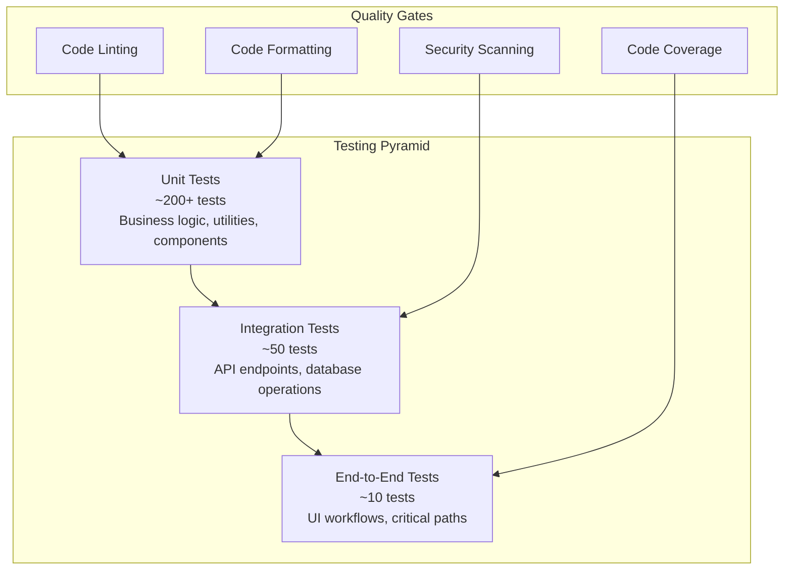

# CertiTrack - Estrategia de Pruebas y Garantía de Calidad

## Visión General

Este documento describe la estrategia integral de pruebas para CertiTrack, que abarca pruebas unitarias, pruebas de integración, pruebas de extremo a extremo y procesos de garantía de calidad para garantizar un sistema de gestión de certificaciones confiable y robusto.

## Pirámide de Pruebas



## Estrategia de Pruebas de Backend (Go)

### Marco de Pruebas Unitarias

**Stack de Pruebas:**
- **Marco de Pruebas**: Paquete incorporado `testing` de Go
- **Afirmaciones**: `testify/assert` y `testify/require`
- **Simulación**: `testify/mock` y `gomock`
- **Pruebas de Base de Datos**: `testcontainers-go` para pruebas de integración

### Estructura de Pruebas Unitarias

```go
// Example: User Service Unit Tests
package services_test

import (
    "context"
    "testing"
    "time"

    "github.com/stretchr/testify/assert"
    "github.com/stretchr/testify/mock"
    "github.com/stretchr/testify/require"
    "github.com/google/uuid"

    "certitrack/internal/models"
    "certitrack/internal/services"
    "certitrack/internal/repositories/mocks"
)

func TestUserService_CreateUser(t *testing.T) {
    tests := []struct {
        name          string
        input         *models.User
        setupMocks    func(*mocks.UserRepository)
        expectedError string
        expectedUser  *models.User
    }{
        {
            name: "successful user creation",
            input: &models.User{
                Email:     "test@example.com",
                FirstName: "John",
                LastName:  "Doe",
                Role:      "user",
            },
            setupMocks: func(mockRepo *mocks.UserRepository) {
                mockRepo.On("GetByEmail", mock.Anything, "test@example.com").
                    Return(nil, repositories.ErrNotFound)
                mockRepo.On("Create", mock.Anything, mock.AnythingOfType("*models.User")).
                    Return(nil)
            },
            expectedError: "",
            expectedUser: &models.User{
                Email:     "test@example.com",
                FirstName: "John",
                LastName:  "Doe",
                Role:      "user",
                IsActive:  true,
            },
        },
        {
            name: "duplicate email error",
            input: &models.User{
                Email:     "existing@example.com",
                FirstName: "Jane",
                LastName:  "Smith",
                Role:      "user",
            },
            setupMocks: func(mockRepo *mocks.UserRepository) {
                existingUser := &models.User{
                    ID:    uuid.New(),
                    Email: "existing@example.com",
                }
                mockRepo.On("GetByEmail", mock.Anything, "existing@example.com").
                    Return(existingUser, nil)
            },
            expectedError: "user with email already exists",
            expectedUser:  nil,
        },
    }

    for _, tt := range tests {
        t.Run(tt.name, func(t *testing.T) {
            // Setup
            mockRepo := new(mocks.UserRepository)
            mockPasswordService := new(mocks.PasswordService)
            
            if tt.setupMocks != nil {
                tt.setupMocks(mockRepo)
            }

            userService := services.NewUserService(mockRepo, mockPasswordService)

            // Execute
            result, err := userService.CreateUser(context.Background(), tt.input)

            // Assert
            if tt.expectedError != "" {
                assert.Error(t, err)
                assert.Contains(t, err.Error(), tt.expectedError)
                assert.Nil(t, result)
            } else {
                assert.NoError(t, err)
                assert.NotNil(t, result)
                assert.Equal(t, tt.expectedUser.Email, result.Email)
                assert.Equal(t, tt.expectedUser.FirstName, result.FirstName)
                assert.True(t, result.IsActive)
            }

            mockRepo.AssertExpectations(t)
        })
    }
}
```

### Pruebas de Integración

```go
// Example: Database Integration Tests
package repositories_test

import (
    "context"
    "testing"
    "time"

    "github.com/stretchr/testify/assert"
    "github.com/stretchr/testify/require"
    "github.com/testcontainers/testcontainers-go"
    "github.com/testcontainers/testcontainers-go/modules/postgres"
    "gorm.io/gorm"

    "certitrack/internal/models"
    "certitrack/internal/repositories"
    "certitrack/pkg/database"
)

func TestUserRepository_Integration(t *testing.T) {
    // Setup test database
    ctx := context.Background()
    
    postgresContainer, err := postgres.RunContainer(ctx,
        testcontainers.WithImage("postgres:15-alpine"),
        postgres.WithDatabase("testdb"),
        postgres.WithUsername("testuser"),
        postgres.WithPassword("testpass"),
        testcontainers.WithWaitStrategy(
            wait.ForLog("database system is ready to accept connections").
                WithOccurrence(2).WithStartupTimeout(5*time.Second)),
    )
    require.NoError(t, err)
    defer postgresContainer.Terminate(ctx)

    // Get connection string
    connStr, err := postgresContainer.ConnectionString(ctx, "sslmode=disable")
    require.NoError(t, err)

    // Setup database
    db, err := database.Connect(connStr)
    require.NoError(t, err)

    // Run migrations
    err = database.Migrate(db)
    require.NoError(t, err)

    // Create repository
    userRepo := repositories.NewUserRepository(db)

    t.Run("Create and Get User", func(t *testing.T) {
        // Create user
        user := &models.User{
            Email:     "integration@test.com",
            FirstName: "Integration",
            LastName:  "Test",
            Role:      "user",
            IsActive:  true,
        }

        err := userRepo.Create(ctx, user)
        require.NoError(t, err)
        assert.NotEqual(t, uuid.Nil, user.ID)

        // Get user
        retrieved, err := userRepo.GetByID(ctx, user.ID)
        require.NoError(t, err)
        assert.Equal(t, user.Email, retrieved.Email)
        assert.Equal(t, user.FirstName, retrieved.FirstName)
    })

    t.Run("List Users with Pagination", func(t *testing.T) {
        // Create multiple users
        for i := 0; i < 5; i++ {
            user := &models.User{
                Email:     fmt.Sprintf("user%d@test.com", i),
                FirstName: fmt.Sprintf("User%d", i),
                LastName:  "Test",
                Role:      "user",
                IsActive:  true,
            }
            err := userRepo.Create(ctx, user)
            require.NoError(t, err)
        }

        // Test pagination
        users, total, err := userRepo.List(ctx, repositories.ListOptions{
            Page:  1,
            Limit: 3,
        })
        require.NoError(t, err)
        assert.Len(t, users, 3)
        assert.GreaterOrEqual(t, total, int64(5))
    })
}
```

### Pruebas de API

```go
// Example: HTTP Handler Tests
package handlers_test

import (
    "bytes"
    "encoding/json"
    "net/http"
    "net/http/httptest"
    "testing"

    "github.com/gin-gonic/gin"
    "github.com/stretchr/testify/assert"
    "github.com/stretchr/testify/mock"

    "certitrack/internal/handlers"
    "certitrack/internal/services/mocks"
)

func TestUserHandler_CreateUser(t *testing.T) {
    gin.SetMode(gin.TestMode)

    tests := []struct {
        name           string
        requestBody    interface{}
        setupMocks     func(*mocks.UserService)
        expectedStatus int
        expectedBody   string
    }{
        {
            name: "successful user creation",
            requestBody: map[string]interface{}{
                "email":     "test@example.com",
                "firstName": "John",
                "lastName":  "Doe",
                "role":      "user",
            },
            setupMocks: func(mockService *mocks.UserService) {
                mockService.On("CreateUser", mock.Anything, mock.AnythingOfType("*models.User")).
                    Return(&models.User{
                        ID:        uuid.New(),
                        Email:     "test@example.com",
                        FirstName: "John",
                        LastName:  "Doe",
                        Role:      "user",
                    }, nil)
            },
            expectedStatus: http.StatusCreated,
        },
        {
            name: "invalid request body",
            requestBody: map[string]interface{}{
                "email": "invalid-email",
            },
            setupMocks:     func(*mocks.UserService) {},
            expectedStatus: http.StatusBadRequest,
        },
    }

    for _, tt := range tests {
        t.Run(tt.name, func(t *testing.T) {
            // Setup
            mockService := new(mocks.UserService)
            tt.setupMocks(mockService)

            handler := handlers.NewUserHandler(mockService)
            router := gin.New()
            router.POST("/users", handler.CreateUser)

            // Prepare request
            body, _ := json.Marshal(tt.requestBody)
            req := httptest.NewRequest(http.MethodPost, "/users", bytes.NewBuffer(body))
            req.Header.Set("Content-Type", "application/json")
            w := httptest.NewRecorder()

            // Execute
            router.ServeHTTP(w, req)

            // Assert
            assert.Equal(t, tt.expectedStatus, w.Code)
            mockService.AssertExpectations(t)
        })
    }
}
```

## Estrategia de Pruebas de Frontend (React/Next.js)

### Stack de Pruebas

- **Marco de Pruebas**: Jest
- **Pruebas de React**: React Testing Library
- **Pruebas E2E**: Playwright
- **Pruebas de Componentes**: Storybook
- **Simulación**: MSW (Mock Service Worker)

### Pruebas Unitarias de Componentes

```typescript
// Example: Component Unit Tests
import { render, screen, fireEvent, waitFor } from '@testing-library/react';
import { jest } from '@jest/globals';
import { FileUpload } from '../FileUpload';

// Mock the API client
jest.mock('../../services/api', () => ({
  uploadDocument: jest.fn(),
}));

describe('FileUpload Component', () => {
  const mockOnUploadComplete = jest.fn();
  const mockOnUploadError = jest.fn();

  beforeEach(() => {
    jest.clearAllMocks();
  });

  it('renders upload area correctly', () => {
    render(
      <FileUpload
        certificationId="test-id"
        onUploadComplete={mockOnUploadComplete}
        onUploadError={mockOnUploadError}
      />
    );

    expect(screen.getByText(/drop files here/i)).toBeInTheDocument();
    expect(screen.getByText(/select files/i)).toBeInTheDocument();
  });

  it('handles file selection', async () => {
    const mockFile = new File(['test content'], 'test.pdf', {
      type: 'application/pdf',
    });

    render(
      <FileUpload
        certificationId="test-id"
        onUploadComplete={mockOnUploadComplete}
        onUploadError={mockOnUploadError}
      />
    );

    const fileInput = screen.getByLabelText(/select files/i);
    fireEvent.change(fileInput, { target: { files: [mockFile] } });

    await waitFor(() => {
      expect(mockOnUploadComplete).toHaveBeenCalled();
    });
  });

  it('shows error for invalid file type', async () => {
    const mockFile = new File(['test content'], 'test.exe', {
      type: 'application/x-executable',
    });

    render(
      <FileUpload
        certificationId="test-id"
        onUploadComplete={mockOnUploadComplete}
        onUploadError={mockOnUploadError}
      />
    );

    const fileInput = screen.getByLabelText(/select files/i);
    fireEvent.change(fileInput, { target: { files: [mockFile] } });

    await waitFor(() => {
      expect(mockOnUploadError).toHaveBeenCalledWith(
        expect.stringContaining('not allowed')
      );
    });
  });
});
```

### Pruebas de Integración con MSW

```typescript
// Example: API Integration Tests
import { rest } from 'msw';
import { setupServer } from 'msw/node';
import { render, screen, fireEvent, waitFor } from '@testing-library/react';
import { CertificationList } from '../CertificationList';

// Setup MSW server
const server = setupServer(
  rest.get('/api/v1/certifications', (req, res, ctx) => {
    return res(
      ctx.json({
        success: true,
        data: {
          items: [
            {
              id: '1',
              certificationType: { name: 'First Aid' },
              person: { firstName: 'John', lastName: 'Doe' },
              expirationDate: '2024-12-31',
              status: 'active',
            },
          ],
          pagination: { page: 1, limit: 20, total: 1, totalPages: 1 },
        },
      })
    );
  })
);

beforeAll(() => server.listen());
afterEach(() => server.resetHandlers());
afterAll(() => server.close());

describe('CertificationList Integration', () => {
  it('loads and displays certifications', async () => {
    render(<CertificationList />);

    expect(screen.getByText(/loading/i)).toBeInTheDocument();

    await waitFor(() => {
      expect(screen.getByText('First Aid')).toBeInTheDocument();
      expect(screen.getByText('John Doe')).toBeInTheDocument();
    });
  });

  it('handles API errors gracefully', async () => {
    server.use(
      rest.get('/api/v1/certifications', (req, res, ctx) => {
        return res(ctx.status(500), ctx.json({ error: 'Server error' }));
      })
    );

    render(<CertificationList />);

    await waitFor(() => {
      expect(screen.getByText(/error loading/i)).toBeInTheDocument();
    });
  });
});
```

## Pruebas de Extremo a Extremo

### Configuración de Playwright

```typescript
// playwright.config.ts
import { defineConfig, devices } from '@playwright/test';

export default defineConfig({
  testDir: './e2e',
  fullyParallel: true,
  forbidOnly: !!process.env.CI,
  retries: process.env.CI ? 2 : 0,
  workers: process.env.CI ? 1 : undefined,
  reporter: 'html',
  use: {
    baseURL: 'http://localhost:3000',
    trace: 'on-first-retry',
    screenshot: 'only-on-failure',
  },
  projects: [
    {
      name: 'chromium',
      use: { ...devices['Desktop Chrome'] },
    },
    {
      name: 'firefox',
      use: { ...devices['Desktop Firefox'] },
    },
    {
      name: 'webkit',
      use: { ...devices['Desktop Safari'] },
    },
  ],
  webServer: {
    command: 'npm run dev',
    url: 'http://localhost:3000',
    reuseExistingServer: !process.env.CI,
  },
});
```

### Ejemplos de Pruebas E2E

```typescript
// e2e/certification-management.spec.ts
import { test, expect } from '@playwright/test';

test.describe('Certification Management', () => {
  test.beforeEach(async ({ page }) => {
    // Login as admin user
    await page.goto('/login');
    await page.fill('[data-testid=email]', 'admin@test.com');
    await page.fill('[data-testid=password]', 'password123');
    await page.click('[data-testid=login-button]');
    await expect(page).toHaveURL('/dashboard');
  });

  test('should create new certification', async ({ page }) => {
    // Navigate to certifications
    await page.click('[data-testid=nav-certifications]');
    await expect(page).toHaveURL('/certifications');

    // Click add certification
    await page.click('[data-testid=add-certification]');
    await expect(page).toHaveURL('/certifications/new');

    // Fill form
    await page.selectOption('[data-testid=certification-type]', 'First Aid');
    await page.selectOption('[data-testid=assign-to-person]', 'John Doe');
    await page.fill('[data-testid=certificate-number]', 'FA-2024-001');
    await page.fill('[data-testid=issuing-authority]', 'Red Cross');
    await page.fill('[data-testid=issue-date]', '2024-01-01');
    await page.fill('[data-testid=expiration-date]', '2026-01-01');

    // Submit form
    await page.click('[data-testid=save-certification]');

    // Verify success
    await expect(page).toHaveURL('/certifications');
    await expect(page.locator('[data-testid=success-message]')).toBeVisible();
    await expect(page.locator('text=FA-2024-001')).toBeVisible();
  });

  test('should upload document to certification', async ({ page }) => {
    // Navigate to specific certification
    await page.goto('/certifications/test-cert-id');

    // Upload file
    const fileInput = page.locator('[data-testid=file-upload]');
    await fileInput.setInputFiles('test-files/certificate.pdf');

    // Wait for upload to complete
    await expect(page.locator('[data-testid=upload-success]')).toBeVisible();
    await expect(page.locator('text=certificate.pdf')).toBeVisible();
  });

  test('should show expiring certifications on dashboard', async ({ page }) => {
    await page.goto('/dashboard');

    // Check expiring certifications section
    const expiringSection = page.locator('[data-testid=expiring-certifications]');
    await expect(expiringSection).toBeVisible();

    // Verify expiring certification appears
    await expect(expiringSection.locator('text=John Doe')).toBeVisible();
    await expect(expiringSection.locator('text=First Aid')).toBeVisible();
  });
});
```

## Pruebas de Rendimiento

### Pruebas de Carga con k6

```javascript
// load-test.js
import http from 'k6/http';
import { check, sleep } from 'k6';

export let options = {
  stages: [
    { duration: '2m', target: 10 }, // Ramp up
    { duration: '5m', target: 10 }, // Stay at 10 users
    { duration: '2m', target: 20 }, // Ramp up to 20 users
    { duration: '5m', target: 20 }, // Stay at 20 users
    { duration: '2m', target: 0 },  // Ramp down
  ],
  thresholds: {
    http_req_duration: ['p(95)<500'], // 95% of requests under 500ms
    http_req_failed: ['rate<0.1'],    // Error rate under 10%
  },
};

const BASE_URL = 'http://localhost:8080/api/v1';

export function setup() {
  // Login and get token
  const loginRes = http.post(`${BASE_URL}/auth/login`, {
    email: 'test@example.com',
    password: 'password123',
  });
  
  const token = loginRes.json('data.token');
  return { token };
}

export default function(data) {
  const headers = {
    'Authorization': `Bearer ${data.token}`,
    'Content-Type': 'application/json',
  };

  // Test various endpoints
  const responses = http.batch([
    ['GET', `${BASE_URL}/certifications`, null, { headers }],
    ['GET', `${BASE_URL}/people`, null, { headers }],
    ['GET', `${BASE_URL}/equipment`, null, { headers }],
    ['GET', `${BASE_URL}/reports/dashboard`, null, { headers }],
  ]);

  responses.forEach((res) => {
    check(res, {
      'status is 200': (r) => r.status === 200,
      'response time < 500ms': (r) => r.timings.duration < 500,
    });
  });

  sleep(1);
}
```

## Gestión de Datos de Prueba

### Datos de Prueba Fijos

```go
// testdata/fixtures.go
package testdata

import (
    "time"
    "github.com/google/uuid"
    "certitrack/internal/models"
)

func CreateTestUser() *models.User {
    return &models.User{
        ID:        uuid.New(),
        Email:     "test@example.com",
        FirstName: "Test",
        LastName:  "User",
        Role:      "user",
        IsActive:  true,
        CreatedAt: time.Now(),
        UpdatedAt: time.Now(),
    }
}

func CreateTestCertification() *models.Certification {
    return &models.Certification{
        ID:                 uuid.New(),
        CertificationTypeID: uuid.New(),
        PersonID:           uuid.New(),
        CertificateNumber:  "TEST-001",
        IssuingAuthority:   "Test Authority",
        IssueDate:         time.Now().AddDate(0, -6, 0),
        ExpirationDate:    time.Now().AddDate(2, 0, 0),
        Status:            "active",
        CreatedAt:         time.Now(),
        UpdatedAt:         time.Now(),
    }
}
```

### Siembra de Base de Datos para Pruebas

```go
// testutils/database.go
package testutils

import (
    "context"
    "certitrack/internal/models"
    "certitrack/testdata"
    "gorm.io/gorm"
)

func SeedTestData(db *gorm.DB) error {
    ctx := context.Background()

    // Create test users
    users := []*models.User{
        testdata.CreateTestUser(),
        {
            Email:     "admin@test.com",
            FirstName: "Admin",
            LastName:  "User",
            Role:      "admin",
            IsActive:  true,
        },
    }

    for _, user := range users {
        if err := db.Create(user).Error; err != nil {
            return err
        }
    }

    // Create test certification types
    certTypes := []*models.CertificationType{
        {
            Name:                  "First Aid",
            Category:             "safety",
            DefaultValidityPeriod: 730,
            RequiresRenewal:      true,
            IsActive:             true,
        },
    }

    for _, certType := range certTypes {
        if err := db.Create(certType).Error; err != nil {
            return err
        }
    }

    return nil
}
```

## Integración y Despliegue Continuo

### Flujo de Trabajo con GitHub Actions

```yaml
# .github/workflows/test.yml
name: Test Suite

on:
  push:
    branches: [ main, develop ]
  pull_request:
    branches: [ main ]

jobs:
  backend-tests:
    runs-on: ubuntu-latest
    
    services:
      postgres:
        image: postgres:15
        env:
          POSTGRES_PASSWORD: postgres
          POSTGRES_DB: certitrack_test
        options: >-
          --health-cmd pg_isready
          --health-interval 10s
          --health-timeout 5s
          --health-retries 5
        ports:
          - 5432:5432

      redis:
        image: redis:7
        options: >-
          --health-cmd "redis-cli ping"
          --health-interval 10s
          --health-timeout 5s
          --health-retries 5
        ports:
          - 6379:6379

    steps:
    - uses: actions/checkout@v4
    
    - name: Set up Go
      uses: actions/setup-go@v4
      with:
        go-version: '1.21'
    
    - name: Cache Go modules
      uses: actions/cache@v3
      with:
        path: ~/go/pkg/mod
        key: ${{ runner.os }}-go-${{ hashFiles('**/go.sum') }}
        restore-keys: |
          ${{ runner.os }}-go-

    - name: Install dependencies
      run: |
        cd backend
        go mod download

    - name: Run linting
      run: |
        cd backend
        go install github.com/golangci/golangci-lint/cmd/golangci-lint@latest
        golangci-lint run

    - name: Run tests
      run: |
        cd backend
        go test -v -race -coverprofile=coverage.out ./...

    - name: Upload coverage
      uses: codecov/codecov-action@v3
      with:
        file: ./backend/coverage.out

  frontend-tests:
    runs-on: ubuntu-latest

    steps:
    - uses: actions/checkout@v4
    
    - name: Set up Node.js
      uses: actions/setup-node@v4
      with:
        node-version: '18'
        cache: 'npm'
        cache-dependency-path: frontend/package-lock.json

    - name: Install dependencies
      run: |
        cd frontend
        npm ci

    - name: Run linting
      run: |
        cd frontend
        npm run lint

    - name: Run type checking
      run: |
        cd frontend
        npm run type-check

    - name: Run unit tests
      run: |
        cd frontend
        npm run test:coverage

    - name: Upload coverage
      uses: codecov/codecov-action@v3
      with:
        file: ./frontend/coverage/lcov.info

  e2e-tests:
    runs-on: ubuntu-latest
    needs: [backend-tests, frontend-tests]

    steps:
    - uses: actions/checkout@v4
    
    - name: Set up Node.js
      uses: actions/setup-node@v4
      with:
        node-version: '18'
        cache: 'npm'
        cache-dependency-path: frontend/package-lock.json

    - name: Install dependencies
      run: |
        cd frontend
        npm ci

    - name: Install Playwright
      run: |
        cd frontend
        npx playwright install --with-deps

    - name: Start application
      run: |
        docker-compose -f docker-compose.test.yml up -d
        sleep 30

    - name: Run E2E tests
      run: |
        cd frontend
        npx playwright test

    - name: Upload test results
      uses: actions/upload-artifact@v3
      if: failure()
      with:
        name: playwright-report
        path: frontend/playwright-report/
```

## Puertas de Calidad

### Requisitos de Cobertura de Código

- **Backend**: Mínimo 80% de cobertura de código
- **Frontend**: Mínimo 75% de cobertura de código
- **Rutas críticas**: 95% de cobertura requerida

### Métricas de Calidad

```yaml
# sonar-project.properties
sonar.projectKey=certitrack
sonar.organization=company
sonar.sources=.
sonar.exclusions=**/*_test.go,**/node_modules/**,**/coverage/**
sonar.tests=.
sonar.test.inclusions=**/*_test.go,**/*.test.ts,**/*.spec.ts
sonar.go.coverage.reportPaths=backend/coverage.out
sonar.javascript.lcov.reportPaths=frontend/coverage/lcov.info
```

### Pruebas de Rendimiento

```go
// Example: Performance Benchmarks
func BenchmarkUserService_CreateUser(b *testing.B) {
    // Setup
    mockRepo := new(mocks.UserRepository)
    mockRepo.On("GetByEmail", mock.Anything, mock.Anything).Return(nil, repositories.ErrNotFound)
    mockRepo.On("Create", mock.Anything, mock.Anything).Return(nil)
    
    service := services.NewUserService(mockRepo, nil)
    user := testdata.CreateTestUser()

    b.ResetTimer()
    for i := 0; i < b.N; i++ {
        _, err := service.CreateUser(context.Background(), user)
        if err != nil {
            b.Fatal(err)
        }
    }
}
```

Esta estrategia de pruebas integral garantiza la entrega de software de alta calidad y confiable para CertiTrack, manteniendo la velocidad de desarrollo y detectando problemas temprano en el ciclo de desarrollo.