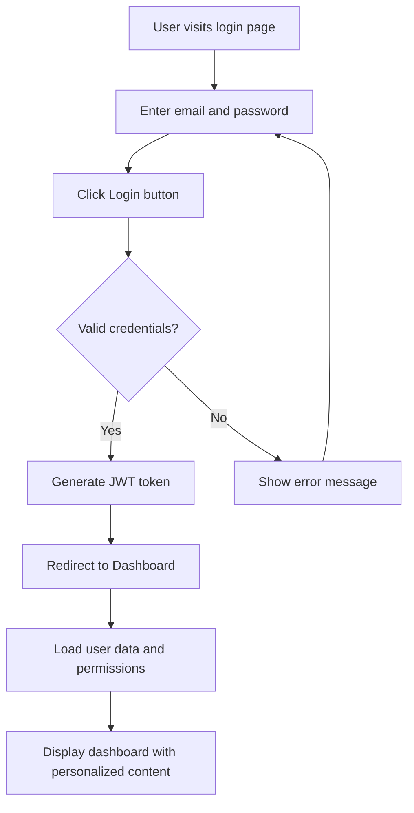
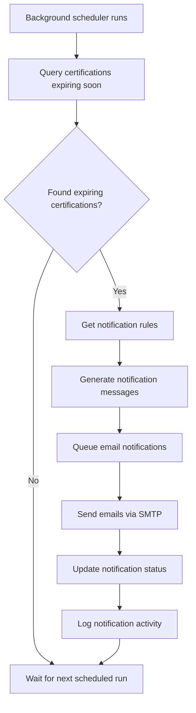
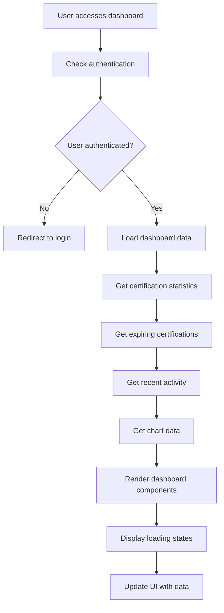
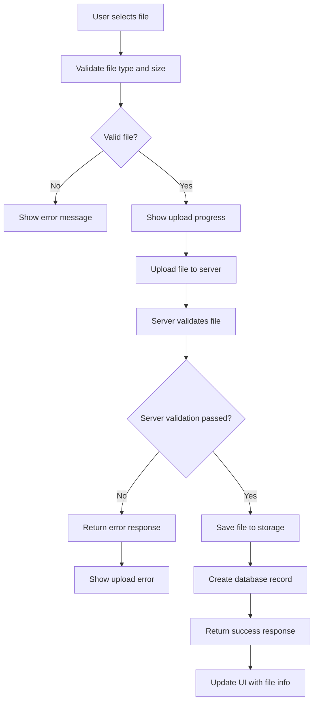

# CertiTrack - Diseño de Interfaz de Usuario y Flujos

## Principios de Diseño

### Diseño Visual
- **Limpio y Profesional**: Diseño minimalista enfocado en la claridad de los datos
- **Responsivo**: Enfoque mobile-first con optimización para escritorio
- **Accesibilidad**: Cumplimiento con WCAG 2.1 AA
- **Consistente**: Sistema de diseño unificado con componentes reutilizables

### Experiencia de Usuario
- **Navegación Intuitiva**: Jerarquía clara de la información
- **Flujos de Trabajo Eficientes**: Minimizar los clics para completar tareas
- **Información Contextual**: Datos relevantes en el momento adecuado
- **Revelación Progresiva**: Mostrar detalles cuando sean necesarios

## Esquema de Colores y Tipografía

### Colores Primarios
- **Azul Primario**: #2563EB (Acciones, enlaces, botones principales)
- **Verde de Éxito**: #059669 (Certificaciones activas, estados de éxito)
- **Naranja de Advertencia**: #D97706 (Notificaciones de próximas a vencer)
- **Rojo de Peligro**: #DC2626 (Certificaciones vencidas, errores)
- **Gris Neutro**: #6B7280 (Texto, bordes, fondos)

### Tipografía
- **Encabezados**: Inter, Negrita (24px, 20px, 18px, 16px)
- **Texto del Cuerpo**: Inter, Normal (14px, 16px)
- **Texto Pequeño**: Inter, Normal (12px)

## Estructura del Diseño

### Navegación Superior
```
[CertiTrack Logo] [Dashboard] [People] [Equipment] [Certifications] [Reports] [User Menu ▼]
```

### Navegación Lateral (Alternativa)
```
┌─────────────────┬─────────────────────────────────────┐
│ CertiTrack      │ Main Content Area                   │
│                 │                                     │
│ 📊 Dashboard    │                                     │
│ 👥 People       │                                     │
│ 🔧 Equipment    │                                     │
│ 📜 Certifications│                                    │
│ 📈 Reports      │                                     │
│ ⚙️  Settings    │                                     │
│                 │                                     │
│ [User Profile]  │                                     │
└─────────────────┴─────────────────────────────────────┘
```

## Maquetas de Páginas

### 1. Página de Inicio de Sesión

```
┌─────────────────────────────────────────────────────────┐
│                    CertiTrack                           │
│              Certification Management                   │
│                                                         │
│    ┌─────────────────────────────────────────────┐     │
│    │                Login                        │     │
│    │                                             │     │
│    │  Email Address                              │     │
│    │  [________________________]                │     │
│    │                                             │     │
│    │  Password                                   │     │
│    │  [________________________]                │     │
│    │                                             │     │
│    │  [ ] Remember me    [Forgot Password?]     │     │
│    │                                             │     │
│    │           [Login Button]                    │     │
│    └─────────────────────────────────────────────┘     │
│                                                         │
└─────────────────────────────────────────────────────────┘
```

### 2. Panel de Control

```
┌─────────────────────────────────────────────────────────────────────────────────┐
│ [Header Navigation]                                          [User: John Doe ▼] │
├─────────────────────────────────────────────────────────────────────────────────┤
│                                Dashboard                                        │
│                                                                                 │
│ ┌─────────────┐ ┌─────────────┐ ┌─────────────┐ ┌─────────────┐                │
│ │   Total     │ │   Active    │ │  Expiring   │ │   Expired   │                │
│ │Certifications│ │Certifications│ │  (30 days)  │ │Certifications│               │
│ │    1,250    │ │    1,100    │ │     45      │ │     150     │                │
│ └─────────────┘ └─────────────┘ └─────────────┘ └─────────────┘                │
│                                                                                 │
│ ┌─────────────────────────────────────────────────────────────────────────────┐ │
│ │                        Expiring Soon (Next 30 Days)                        │ │
│ │ ┌─────────────────────────────────────────────────────────────────────────┐ │ │
│ │ │ Name          │ Certification      │ Expires    │ Days Left │ Action   │ │ │
│ │ ├─────────────────────────────────────────────────────────────────────────┤ │ │
│ │ │ John Doe      │ First Aid         │ 2024-02-15 │    15     │ [Renew]  │ │ │
│ │ │ Equipment #1  │ Safety Inspection │ 2024-02-20 │    20     │ [Renew]  │ │ │
│ │ │ Jane Smith    │ Forklift License  │ 2024-02-25 │    25     │ [Renew]  │ │ │
│ │ └─────────────────────────────────────────────────────────────────────────┘ │ │
│ └─────────────────────────────────────────────────────────────────────────────┘ │
│                                                                                 │
│ ┌─────────────────────────────┐ ┌─────────────────────────────────────────────┐ │
│ │    Certification by Category │ │           Recent Activity                   │ │
│ │                             │ │                                             │ │
│ │    [Pie Chart]              │ │ • John Doe - First Aid renewed              │ │
│ │    • Safety: 600            │ │ • Equipment #5 - Calibration added          │ │
│ │    • Professional: 400      │ │ • Jane Smith - Profile updated              │ │
│ │    • Equipment: 250         │ │ • New user registered: Mike Johnson         │ │
│ │                             │ │                                             │ │
│ └─────────────────────────────┘ └─────────────────────────────────────────────┘ │
└─────────────────────────────────────────────────────────────────────────────────┘
```

### 3. Gestión de Personas

```
┌─────────────────────────────────────────────────────────────────────────────────┐
│ [Header Navigation]                                                             │
├─────────────────────────────────────────────────────────────────────────────────┤
│                              People Management                                  │
│                                                                                 │
│ [Search: ________________] [Department: All ▼] [Status: All ▼] [+ Add Person]   │
│                                                                                 │
│ ┌─────────────────────────────────────────────────────────────────────────────┐ │
│ │ Employee ID │ Name        │ Department │ Certifications │ Expiring │ Actions │ │
│ ├─────────────────────────────────────────────────────────────────────────────┤ │
│ │ EMP001      │ John Doe    │ Engineering│ 5 (2 expiring)│    🟡    │ [View]  │ │
│ │ EMP002      │ Jane Smith  │ HR         │ 3 (0 expiring)│    🟢    │ [View]  │ │
│ │ EMP003      │ Mike Johnson│ Operations │ 4 (1 expired) │    🔴    │ [View]  │ │
│ │ EMP004      │ Sarah Wilson│ Safety     │ 6 (0 expiring)│    🟢    │ [View]  │ │
│ └─────────────────────────────────────────────────────────────────────────────┘ │
│                                                                                 │
│ [Previous] [1] [2] [3] [4] [5] [Next]                    Showing 1-20 of 156   │
└─────────────────────────────────────────────────────────────────────────────────┘
```

### 4. Vista Detallada de Persona

```
┌─────────────────────────────────────────────────────────────────────────────────┐
│ [Header Navigation]                                                             │
├─────────────────────────────────────────────────────────────────────────────────┤
│ [← Back to People] John Doe (EMP001)                              [Edit Person] │
│                                                                                 │
│ ┌─────────────────────────────┐ ┌─────────────────────────────────────────────┐ │
│ │        Personal Info        │ │              Certifications                 │ │
│ │                             │ │                                             │ │
│ │ Employee ID: EMP001         │ │ [+ Add Certification]                       │ │
│ │ Email: john.doe@company.com │ │                                             │ │
│ │ Phone: +1234567890          │ │ ┌─────────────────────────────────────────┐ │ │
│ │ Department: Engineering     │ │ │ First Aid Certification                 │ │ │
│ │ Position: Software Engineer │ │ │ Certificate: FA-2024-001                │ │ │
│ │ Hire Date: 2023-01-15       │ │ │ Expires: 2026-01-01 (365 days)         │ │ │
│ │                             │ │ │ Status: Active 🟢                       │ │ │
│ └─────────────────────────────┘ │ │ [View] [Edit] [Renew]                   │ │ │
│                                 │ └─────────────────────────────────────────┘ │ │
│                                 │                                             │ │
│                                 │ ┌─────────────────────────────────────────┐ │ │
│                                 │ │ Forklift Operation License              │ │ │
│                                 │ │ Certificate: FL-2023-045                │ │ │
│                                 │ │ Expires: 2024-03-15 (45 days) 🟡       │ │ │
│                                 │ │ Status: Active                          │ │ │
│                                 │ │ [View] [Edit] [Renew]                   │ │ │
│                                 │ └─────────────────────────────────────────┘ │ │
│                                 └─────────────────────────────────────────────┘ │
└─────────────────────────────────────────────────────────────────────────────────┘
```

### 5. Gestión de Certificaciones

```
┌─────────────────────────────────────────────────────────────────────────────────┐
│ [Header Navigation]                                                             │
├─────────────────────────────────────────────────────────────────────────────────┤
│                           Certification Management                              │
│                                                                                 │
│ [Search: ________________] [Type: All ▼] [Status: All ▼] [+ Add Certification]  │
│ [Expiring in: All ▼] [Category: All ▼] [Export CSV] [Export PDF]               │
│                                                                                 │
│ ┌─────────────────────────────────────────────────────────────────────────────┐ │
│ │ Holder      │ Type           │ Certificate # │ Expires    │ Status │ Actions │ │
│ ├─────────────────────────────────────────────────────────────────────────────┤ │
│ │ John Doe    │ First Aid      │ FA-2024-001   │ 2026-01-01 │ 🟢     │ [View]  │ │
│ │ Jane Smith  │ Forklift       │ FL-2023-045   │ 2024-03-15 │ 🟡     │ [View]  │ │
│ │ Equipment#1 │ Calibration    │ CAL-2024-012  │ 2024-02-01 │ 🔴     │ [View]  │ │
│ │ Mike Johnson│ Fire Safety    │ FS-2023-089   │ 2024-12-31 │ 🟢     │ [View]  │ │
│ └─────────────────────────────────────────────────────────────────────────────┘ │
│                                                                                 │
│ [Previous] [1] [2] [3] [4] [5] [Next]                   Showing 1-20 of 1,250  │
└─────────────────────────────────────────────────────────────────────────────────┘
```

### 6. Formulario de Agregar/Editar Certificación

```
┌─────────────────────────────────────────────────────────────────────────────────┐
│ [Header Navigation]                                                             │
├─────────────────────────────────────────────────────────────────────────────────┤
│ [← Back] Add New Certification                                                  │
│                                                                                 │
│ ┌─────────────────────────────────────────────────────────────────────────────┐ │
│ │                          Certification Details                              │ │
│ │                                                                             │ │
│ │ Certification Type *                                                        │ │
│ │ [First Aid Certification                                              ▼]    │ │
│ │                                                                             │ │
│ │ Assign To *                                                                 │ │
│ │ ○ Person  ○ Equipment                                                       │ │
│ │ [John Doe (EMP001)                                                    ▼]    │ │
│ │                                                                             │ │
│ │ Certificate Number                    Issuing Authority *                   │ │
│ │ [FA-2024-002____________]             [Red Cross___________________]        │ │
│ │                                                                             │ │
│ │ Issue Date *              Expiration Date *                                 │ │
│ │ [2024-01-15_____]         [2026-01-15_____]                                │ │
│ │                                                                             │ │
│ │ Notes                                                                       │ │
│ │ ┌─────────────────────────────────────────────────────────────────────────┐ │ │
│ │ │ Additional notes about this certification...                            │ │ │
│ │ └─────────────────────────────────────────────────────────────────────────┘ │ │
│ │                                                                             │ │
│ │ Documents                                                                   │ │
│ │ [Drag & Drop files here or click to browse]                                │ │
│ │                                                                             │ │
│ │                                    [Cancel] [Save Certification]           │ │
│ └─────────────────────────────────────────────────────────────────────────────┘ │
└─────────────────────────────────────────────────────────────────────────────────┘
```

## Flujos de Usuario

### 1. Flujo de Inicio de Sesión



### 2. Flujo para Agregar Nueva Certificación

```mermaid
graph TD
    A[User clicks 'Add Certification'] --> B[Open certification form]
    B --> C[Select certification type]
    C --> D[Choose Person or Equipment]
    D --> E[Fill in certification details]
    E --> F[Upload documents (optional)]
    F --> G[Click Save]
    G --> H{Form validation}
    H -->|Invalid| I[Show validation errors]
    I --> E
    H -->|Valid| J[Save to database]
    J --> K[Create audit log entry]
    K --> L[Schedule notifications]
    L --> M[Show success message]
    M --> N[Redirect to certification list]
```

### 3. Flujo de Alerta de Vencimiento de Certificación



### 4. Flujo de Carga de Datos del Panel



### 5. Flujo de Carga de Archivos



## Puntos de Ruptura del Diseño Responsivo

### Móvil (320px - 768px)
- Diseño de una sola columna
- Menú de navegación plegable
- Tablas de datos simplificadas con desplazamiento horizontal
- Tamaños de botones aptos para tacto (mínimo 44px)
- Campos de formulario apilados

### Tableta (768px - 1024px)
- Diseño de dos columnas cuando sea apropiado
- Navegación en barra lateral
- Tablas de datos condensadas
- Optimizado para interacción táctil

### Escritorio (1024px+)
- Diseño completo de múltiples columnas
- Navegación en barra lateral fija
- Tablas de datos con todas las funciones
- Estados de hover y tooltips
- Soporte para navegación por teclado

## Características de Accesibilidad

### Cumplimiento WCAG 2.1 AA
- **Contraste de Color**: Relación mínima de 4.5:1 para texto normal
- **Navegación por Teclado**: Accesibilidad completa por teclado
- **Soporte para Lectores de Pantalla**: Etiquetas y roles ARIA apropiados
- **Gestión del Foco**: Indicadores de foco visibles
- **Texto Alternativo**: Imágenes e iconos con texto descriptivo alternativo

### Diseño Inclusivo
- **Lenguaje**: Claro y sencillo
- **Mensajes de Error**: Descriptivos y accionables
- **Etiquetas de Formularios**: Asociación clara con los campos
- **Estados de Carga**: Indicación clara del estado del sistema

## Biblioteca de Componentes

### Componentes Reutilizables
1. **Tabla de Datos**: Tablas ordenables, filtrables y paginadas
2. **Campo de Formulario**: Estilo consistente para entradas de formulario
3. **Botón**: Variantes primarias, secundarias y de peligro
4. **Modal**: Diálogos de confirmación y formularios
5. **Alerta**: Mensajes de éxito, advertencia, error e información
6. **Insignia**: Indicadores y etiquetas de estado
7. **Selector de Fechas**: Selección de fechas consistente
8. **Cargador de Archivos**: Carga de archivos por arrastrar y soltar
9. **Indicador de Carga**: Indicadores de estado de carga
10. **Información Emergente**: Información de ayuda contextual

Este diseño de interfaz de usuario proporciona una base completa para construir un sistema de gestión de certificaciones intuitivo y eficiente que sirva tanto a administradores como a usuarios regulares de manera efectiva.